# Evaluating and improving, through fusion, a Sentinel-1 method for ranking post-disaster buildings

**Language / Langue :** 🇬🇧 English · 🇫🇷 [Français](partie_2.md)

This long version is the complete satellite component of the GitHub repository; it retains the developments, results and limitations that are condensed in the thesis.

After a sudden-onset disaster, the operational problem is not only to locate damage but to decide where to check first. Optical imagery may be delayed or restricted by cloud cover; Sentinel-1 provides a radar signal available independently of daylight and clouds. That signal does not, however, show damage directly: it measures a change in backscatter, whose interpretation depends on radar geometry, on built structure and on the nature of the observed change [Ballinger, 2025].

This study reimplements and evaluates an approach based on a per-pixel change statistic, subsequently aggregated at building level. It compares that score with other products over explicitly harmonised building footprints, reproduces several methods based on interferometric coherence, and tests rank fusions.

The results show, on the two case studies alone, that a Sentinel-1 score can help prioritise buildings or sectors for checking. Targeted fusion improves the mean AUC of the T-stat alone from 0.740 to 0.764 in the T-stat × OSU configuration. This improvement is measured on the reference data and footprints described here; it constitutes neither a general validation of damage detection nor proof of transferability to other disasters.

## 1 Analysis of existing practice, and the problem addressed

Rapid post-disaster damage assessment today rests largely on the visual interpretation of very high resolution optical imagery. When a clear, recent and sufficiently detailed image is available, the analyst can directly recognise the shapes of buildings, torn-off roofs, collapses, flooded areas, landslides and debris. This readability makes optical imagery the reference for characterising damage.

But that reference depends on a condition not always met in the first hours: having an image that is genuinely usable. After a disaster the image may be missing, acquired too late, partly covered by cloud, insufficiently resolved, or fail to cover the sector that must be analysed. The problem is therefore not merely to obtain an image. It is to obtain a *useful* image at the moment the decision has to be taken.

This section examines that tension between the quality of optical interpretation and the availability constraints that accompany it. It then shows why radar can provide, not a substitute for optical imagery, but a first prioritisation signal when the conditions required for detailed reading are not yet met.

### 1.1 Distinct mechanisms, with optical imagery predominant

The International Charter Space and Major Disasters, Copernicus EMS and UNOSAT are three distinct mechanisms. They may contribute to the same crisis, but they do not share the same mandate, the same activation rules or the same products.

The International Charter allows authorised users to request a coordinated mobilisation of space resources after a disaster. It makes data available under conditions of use; it would therefore be incorrect to say that it simply provides "free" imagery.[^8]

Copernicus EMS is the European emergency mapping service. It produces maps and datasets according to defined activations and areas of interest. Information derived from imagery is interpreted and turned into cartographic products usable by response actors.

UNOSAT provides geospatial analysis within the United Nations system, producing in particular impact maps, exposed-population estimates and damage assessments to support humanitarian coordination.

These mechanisms have one thing in common: optical imagery plays a central role in the information actually mobilised after a disaster.

The International Charter's annual reports allow the split between optical and radar imagery to be observed over the period 2020–2024.

| Year | Optical share | Radar share |
|---|---|---|
| 2020 | 78.3 % | 21.7 % |
| 2021 | 59.4 % | 40.6 % |
| 2022 | 77.5 % | 22.5 % |
| 2023 | 87.2 % | 12.8 % |
| 2024 | 85.3 % | 14.7 % |

**Table 1 — Split between optical and radar imagery mobilised by the International Charter between 2020 and 2024. Source: author's calculations from the activation and imagery data of the International Charter "Space and Major Disasters", 2020–2024. The period studied covers five years only; the variations observed do not support any claim about a structural long-term trend.[^9]**

Optical imagery thus accounts for the majority of images every year. The radar share reaches 40.6 % in 2021, then falls to 12.8 % in 2023 and 14.7 % in 2024. Between 2021 and 2023 it goes from roughly four images in ten to roughly one in eight.

This series should not be read as evidence of a progressive abandonment of radar. It covers five years only. The variations may stem from the nature of the events activated, their geographical distribution, the season, cloud cover, sensor availability or constraints specific to each activation. It does nonetheless establish a robust observation for the period examined: radar contributes to the international response but remains a minority among the images actually mobilised.

The detail of acquisitions also shows a concentration on a limited number of constellations:

| Satellite | Type | Images 2020–2024 |
|---|---|---|
| WorldView-1/2/3 | Optical | 25,556 |
| PlanetScope | Optical | 12,486 |
| GeoEye-1 | Optical | 6,281 |
| Pléiades 1A/1B | Optical | 5,503 |
| Sentinel-1 (all generations) | Radar | 4,695 |

**Table 2 — Principal satellites mobilised by the International Charter, 2020–2024 total. Source: author's calculations from the activation and imagery data of the International Charter "Space and Major Disasters", 2020–2024.**

The availability of information therefore depends not only on the presence of satellites, but also on tasking, on data access, on coverage of the area, and on the mobilisation choices made during each crisis.

### 1.2 Copernicus EMS: anticipating, acquiring, delivering

The three activations studied here illustrate the difference between activation, post-event acquisition and first delivery of a Copernicus EMS product.

| Activation | SAR share | Event → activation | → 1st post acquisition | → 1st delivery |
|---|---|---|---|---|
| EMSR847 — Cyclone Melissa | 22 % | −9.3 h | +35.4 h | +9.3 h |
| EMSR884 — Venezuela earthquake | 8 % | +11.8 h | +6.8 h | +32.9 h |
| EMSR916 — Colombia | 11 % | +4.7 h | +27.0 h | +39.3 h |

**Table 3 — Delays for three Copernicus EMS activations studied. Source: author's calculations from the Copernicus EMS activations studied. The SAR share is the proportion of radar products or acquisitions recorded in the activation. The sample covers three activations and does not support a general rule about Copernicus EMS delays.**

The Melissa case shows that a cyclone can be anticipated: activation EMSR847 precedes the event's passage by 9.3 hours. That anticipation does not, however, guarantee that a usable post-event optical image is immediately available. The first post-event acquisition recorded occurs at +35.4 hours, whereas the first delivery is given at +9.3 hours. These two figures do not describe the same thing: a delivery may rest on other sources or products, and the availability of an acquisition does not guarantee that it is cloud-free or sufficient to read the whole territory.[^10]

For Venezuela, activation occurs at +11.8 hours, the first post-event acquisition at +6.8 hours and the first delivery at +32.9 hours. In the Colombian case, activation occurs at +4.7 hours, the first acquisition at +27.0 hours and the first delivery at +39.3 hours.

These three activations confirm that the stages of the response are not synchronous: activation, acquisition, interpretation and delivery follow different timelines. The first image acquired is not necessarily the first useful image. Likewise, the first delivery does not necessarily mean complete, homogeneous or sufficiently detailed coverage to answer every question an assessment cell may have.

The SAR share remains low in all three activations studied: 22 % for Melissa, 8 % for Venezuela and 11 % for Colombia. This is consistent with the predominance of optical imagery seen in the Charter data. It must nonetheless be read for what it is: an observation over three activations, not an estimate for the whole of Copernicus EMS operations.

### 1.3 An image acquired is not necessarily an image that can be used

The operationally relevant delay is not limited to the delay of the first acquisition. Cloud cover, resolution and the area actually covered must also be known. An image may exist and yet remain unusable over a large part of the affected area.

This distinction matters particularly after a cyclone. Cloud, rain, humidity and the persistence of the weather system are at once components of the phenomenon and obstacles to reading its consequences optically.

The analysis of Maxar Open Data available in Jamaica after Cyclone Melissa (28 October 2025) covers 8,469 tiles, grouped by date and platform, with the number of tiles, the mean, minimum and maximum cloud cover, the mean GSD and the number of tiles whose cover is below 10 %.

The first post-event acquisition exists as early as D+1 (29 October), but only 20 % of the 80 tiles acquired that day have less than 10 % cloud cover. That figure rises to 84 % the next day (D+2), on a smaller sample of 217 tiles, before falling back to 21 % at D+3 (727 tiles), then stabilising progressively between 54 % and 63 % from D+4 and D+5 onwards.

Caveat — this evolution is not monotonic: it reflects the variability of the areas actually imaged each day, since the number and location of tiles acquired change from one day to the next, as much as the progressive improvement in weather conditions. An analysis restricted to a fixed area replayed each day, rather than to the varying set of available tiles, would establish whether the underlying trend really is one of continuous improvement or whether it remains dominated by this selection effect. The calculations are provided in the supplementary materials.

This analysis does not call the value of optical imagery into question. When a very high resolution image is available, cloud-free and covering, it remains the most legible source for visually characterising damage. It simply shows that this condition may be absent precisely in the window where the information is most needed.

### 1.4 The tropical cyclone is a compound hazard

A cyclone does not destroy everywhere in the same way. Its winds, its rainfall, the swell, the storm surge and sometimes tornadoes can damage buildings, cut networks and trigger floods or landslides. A change map must therefore be interpreted in the light of several mechanisms, not of a single cyclonic signature.

The distribution of damage is therefore neither uniform nor entirely random. It depends on the system's track, its speed, the terrain, coastal exposure, prior soil saturation, the size of the cyclone and the configuration of the catchments. Slow-moving systems can concentrate large amounts of rainfall over one area. Exposed relief favours orographic rainfall. Saturated soils make runoff, flooding and landslides more likely.

This description comes from cyclone doctrine and the risk literature; it is not the result of a measurement carried out in this study.

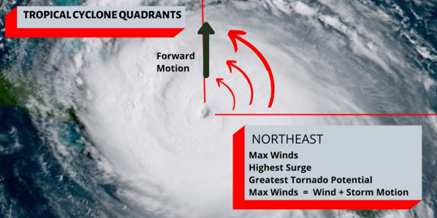

**Figure 1 — Spatial asymmetry of a tropical cyclone's effects. Conceptual diagram showing that a cyclone's effects are not distributed uniformly around its track. In the Northern Hemisphere the right-front quadrant (north-east here) generally combines the maximum wind, the strongest surge and the greatest tornado potential. This asymmetry provides prioritisation information at territorial scale, but supports no conclusion about the state of an individual building.**

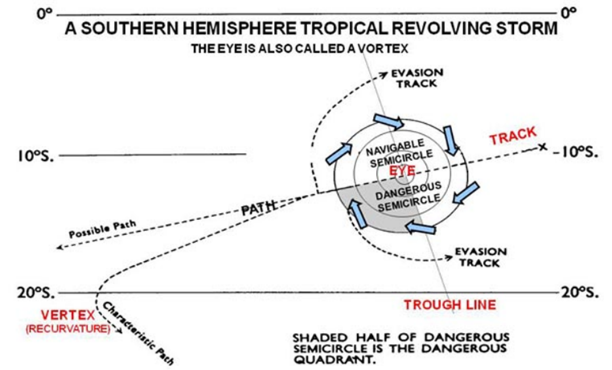

**Figure 2 — Aggravating factors for tropical cyclone damage: a Southern Hemisphere track. Representation of a Southern Hemisphere tropical storm, with its probable track, its recurvature point and the navigable and dangerous semicircles, mirroring the Northern Hemisphere configuration shown in figure A.**

The asymmetry around the track is useful at planning scale. In the Northern Hemisphere the right-front quadrant is generally held to be the sector where the cyclone's translational motion and its circulation reinforce the winds. In the Southern Hemisphere the symmetric situation corresponds to the left-front quadrant.

This rule does not license direct prediction of damage at building scale. Building vulnerability, terrain, local exposure, rainfall, inundation and accessibility strongly modify the effects observed. It does, however, help direct the first acquisitions and the analysis towards the sectors most likely to concentrate impacts.

Two further analyses could strengthen the link between the physics of the hazard and the signal the tool produces.

The first would cross T-stat values with the track of Cyclone Melissa. If the asymmetry described by doctrine is present in the data, one would expect a higher concentration of change signal in the sectors on the side of the track regarded as most exposed. A positive relationship would support spatial consistency between the radar signal and the expected geography of the hazard. A weak or absent relationship would be informative too: it would indicate that the signal also depends on urban structure, humidity, vegetation or other local mechanisms.

The second would compare the T-stat with USGS ShakeMap values for the Venezuelan earthquake. A positive correlation would indicate that the most strongly shaken units tend to receive higher change scores. A weak or absent correlation would clarify the boundaries between modelled macroseismic intensity, damage actually produced and the radar signal's response.

Neither the comparison with Melissa's track nor the one with the Venezuelan ShakeMap was computed here. They are avenues for evaluation, not established results.

### 1.5 Optical imagery remains the reference; radar answers its absence

When two very high resolution optical images clearly show the same building before and after the disaster, the analyst can compare its shapes and its surroundings directly. The radar studied here does not replace that reading: it comes into play mainly when that reading is not yet possible.

The difficulty arises when this condition is not met in the first 24 to 48 hours. Three limitations then matter particularly.

The first is meteorological. Cloud cover, frequent after a cyclone, can mask a large part of the affected area. In Venezuela, up to 31.9 % of the surface of Caraballeda remained masked by cloud in the first very high resolution acquisitions. A second pass, more than ten days after the event, was needed in an attempt to complete the coverage.

The second concerns the extent of the area to be analysed. Assessing a disaster may cover a territory far larger than an analyst can interpret visually in a short time. During Cyclone Melissa, Copernicus activation EMSR847 covered 39 areas of interest across three countries, more than 10,600 km² and 262,154 potentially exposed buildings. Complete optical coverage was achieved only at the end of November, almost a month after the cyclone passed.

The third is tied to the tasked nature of optical imagery. Satellites must be tasked to acquire an image over a given area. That tasking can delay the first acquisition, but also the revision of an analysis when a new image is needed to complete an area or settle a doubt.

Radar escapes the cloud constraint. It acquires by day and by night and, with Sentinel-1, it offers wide coverage and a revisit frequency useful for initial assessment. It does not, however, provide a photograph: it measures an indirect signal, tied to backscatter and to the stability of scatterers.

I therefore looked for a method able to exploit that advantage — not to replace optical interpretation, but to complement it where areas remain under cloud or have not yet been covered at high resolution. The aim is to produce a first prioritisation: to determine the sectors where photo-interpretation effort, aerial acquisition or field checks should be concentrated first.

This question extends an older interest, born of Cyclone Idai in Mozambique in 2019. There I developed the methodology for a logistical vulnerability index and carried out its first computational trials through spatial analysis in GIS. That work, driven by Mozambique, led two years later to the Signal project. It was there that I first came to geomatics, and it was what decided me to train in it. The initial observation was already the same: satellite imagery can provide rapid information, but it is rarely turned into a dynamic prioritisation tool suited to the needs of humanitarian organisations.[^11]

### 1.6 The criteria that will guide the choice of method

The initial intention was to avoid computationally heavy methods, in particular deep learning approaches. That route was tested in ArcGIS Pro while building a reference building layer. The limitations observed were significant: long computation times, adjoining buildings merged together, false detections in dense built-up areas, and strong dependence on the training context.

Lightweight sheet-metal housing in Haiti, an urban area in Venezuela and a Turkish seismic zone do not share the same materials, shapes, surroundings or destruction mechanisms. A supervised method therefore needs training data representative of the context to which it is applied. That dependence on data and on computation is in tension with an operational window of 24 to 48 hours.

A practical constraint is added by the environment chosen for the project: a QGIS plugin does not necessarily have a GPU or a suitable PyTorch environment in which to run a complex deep model.

The work therefore turned towards a statistical method based on radar intensity: the Pixel-Wise T-Test, or PWTT, developed by Ballinger to detect conflict-related damage in Ukraine and Gaza. The method compares each pixel with its own historical behaviour. It requires no training set specific to the cyclone, the earthquake or the territory studied.

The choice answers a requirement of reproducibility and explainability: to produce an indicator whose calculations can be inspected, discussed and replayed, rather than a result from a model that is hard to interpret. In the reference article, Ballinger reports AUCs of around 0.88 in Ukraine and 0.81 in Gaza, over more than 500,000 building footprints across twelve cities.[^12]

The simplicity of the principle does not, however, guarantee that it transfers. The method was developed and validated on armed-conflict damage. It therefore remains to be determined whether it can produce a useful signal on damage of natural origin, in particular after a cyclone and an earthquake, and whether it can do so within a time frame compatible with initial assessment.

The remainder of this part therefore examines:

- the statistical method chosen and its parameters;
- the delay needed to produce a first signal;
- the length of the pre-event baseline;
- the differences observed between cyclone and earthquake;
- the comparison with the other detection products available;
- the contribution of interferometric coherence;
- how to use a score depending on whether the aim is to target a few addresses or to sweep a wider area;
- the limitations tied to resolution, coverage, hazard type and available ground truth.

The point is not to set optical against radar. Optical imagery remains the reference for interpreting damage when a usable image is available. Radar comes into play in the period and in the sectors where that condition is not yet satisfied. It is in that space — between the need for early information and the deferred availability of a detailed reading — that the method studied here belongs.

## 2 Resolution, delay and coverage: the trade-off in optical imagery

An image acquired after the event is not enough: it must arrive in time, actually cover the area sought, and show the objects in sufficient detail. The cases of Black River and Playa Verde set these three requirements side by side; they are not always met by the same source.

### 2.1 Black River: the next day's image is not necessarily the best

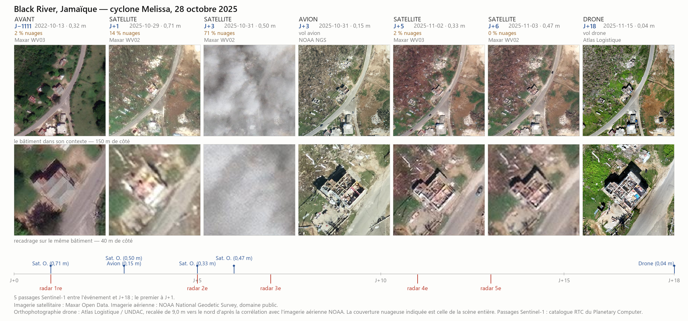

**Figure 3 — Black River, Jamaica: availability, quality and delay of observations after Cyclone Melissa.** The plate compares satellite optical acquisitions, NOAA aerial imagery, drone imagery and Sentinel-1 passes. It shows that an acquisition available at D+1 can be less usable than a later image, because of resolution, cloud cover or viewing angle. Source: Maxar Open Data, NOAA, Atlas Logistique / UNDAC and the Sentinel-1 catalogue.

At Black River the first post-cyclone optical image is available as early as D+1. It has a resolution of 0.71 m and a mean cloud cover of 14 % for the whole scene. That acquisition already allows the sector to be located, but it does not necessarily give a detailed reading of each building. A finer acquisition is available at D+3, with a resolution of 0.50 m. It is, however, affected by 71 % cloud cover, and the building studied is masked by cloud. Here the better theoretical resolution yields no usable information on the target.

The D+5 and D+6 acquisitions are more favourable: they offer 0.33 m and 0.47 m resolution respectively, with 2 % then 0 % cloud cover over the scene. They allow a more comfortable interpretation, but arrive several days after the event.

A scene's mean cloud cover must therefore be read with caution. A scene 71 % covered may be clear over one building and unusable over another. General metadata are not enough to determine this: the image itself must be examined.

Acquisition geometry adds a second constraint. The D+1 image is taken at an off-nadir angle of 36.9°, the highest in the series. The following acquisitions are taken at more favourable angles, from 16.5° down to 10.4°. A strongly oblique view can reduce the apparent quality of the image, lengthen shadows and complicate the interpretation of buildings and their surroundings.

In this case the first genuinely legible information on the building does not necessarily come from the satellite. The NOAA aerial acquisition, flown at D+3 with a resolution of 0.15 m, provides a more detailed observation. It remains limited, however, to the area covered by the flight.

The radar series brings another kind of continuity: Sentinel-1 acquires independently of daylight and cloud cover. Between the event and D+18, five radar passes are available, the first of them around the arrival of the first optical images. Radar does not replace optical imagery; it provides a complementary signal when the optical image is cloudy, oblique or insufficiently legible.

### 2.2 Playa Verde: the acquisitions stop

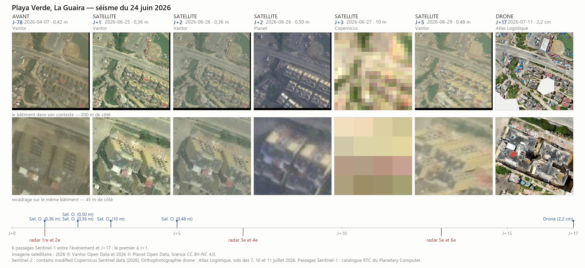

**Figure 4 — Playa Verde, La Guaira: continuity of observations after the earthquake of 24 June 2026.** Optical acquisitions cluster in the first few days, then leave a gap with no new detailed optical observation until the drone orthophotograph at D+17. Sentinel-1 passes maintain observational continuity through that gap. Source: Vantor Open Data, Planet Open Data, Copernicus Sentinel, Atlas Logistique and the Sentinel-1 catalogue.

At Playa Verde the first optical image appears as early as D+1, at a resolution of 0.36 m. Further acquisitions are available at D+2, then a Sentinel-2 image at D+3 and an optical image at D+5. The catalogue therefore looks well populated over the first few days.

After D+5, however, optical acquisitions stop for about twelve days. The next detailed observation shown in the plate is the drone orthophotograph at D+17.

This temporary absence matters for an assessment mission: a highly detailed image may be available at the outset, and then no new usable optical image for several days. The only observations available in that interval are the Sentinel-1 radar acquisitions, with six passes between the event and the drone flight: two around D+1, two around D+7 and two around D+13.

The chronology thus shows three distinct functions:

- optical imagery provides a visual reading when it is cloud-free and sufficiently detailed;
- radar maintains regular observation during periods when optical imagery is absent, cloudy or hard to interpret;
- aerial or drone imagery brings a finer observation when the mission can be organised.

### 2.3 What the two plates show

These two examples do not define a universal delay at which an image becomes usable. They show rather that the useful delay depends on several things at once:

- the date of acquisition;
- cloud cover over the target itself;
- the actual resolution;
- the viewing angle;
- the continuity of acquisitions;
- whether an aircraft or a drone can be mobilised.

The operational question is therefore not only "when is the first image available?" It is also "when do we have an observation reliable enough to decide what to do?"

A detailed optical image may be essential to characterise damage, but it may arrive too late, be masked by cloud, or fail to cover the target at a favourable angle. Radar provides different information: it does not always allow the nature of the damage to be identified directly, but it can flag earlier the sectors where the behaviour of the surface has changed.

To answer that question, a method compatible with the project's constraints had to be chosen: open data, reproducible processing, no training data specific to a particular event, operation over areas chosen by the user, and the possibility of integration into QGIS. The method retained is the Pixel-Wise T-Test (PWTT), which compares, pixel by pixel, the radar values observed before and after the event in order to identify statistically significant changes.

That method is introduced in the following section, before its adaptations, its performance and its limitations are examined in the cyclone and earthquake cases studied.

## 3 State of the art: many maps available, few tools to run

### 3.1 Telling the result from the tool

After a disaster one finds damage maps, consultation portals and published methods. They do not answer the same need. A map delivers the result of an analysis carried out by a third party; a tool lets the assessor choose a new area, a date and parameters, and redo the computation.

This review therefore distinguishes three families. **Runnable tools** (category A) give the user control of the analysis. **Products and portals** (category B) give access to results already computed. **Impact models** (category C) combine a hazard with exposure data without detecting any change in a post-event image. InaSAFE and OpenQuake belong to this last family: they answer useful questions, but not the one addressed here.

The number of products must therefore not be confused with the number of reusable tools. The review devoted to Venezuela records twenty producers of results; it does not imply that twenty methods are runnable by an assessment cell on the next event. It is this computational autonomy that delimits the subject of the present work.

### 3.2 The tools identified, and how they differ

Four runnable approaches or tools were retained in the search, including the development presented in this repository:

- **PWTT**, proposed by Ballinger (2024–2025), computes a per-pixel t-test on Sentinel-1 backscatter series. The method is unsupervised and was released with an Earth Engine application and a Colab notebook; a third-party QGIS plugin also exists.
- The **Rapid Damage Mapping Tool** of Dietrich et al. (2025) exploits Sentinel-1 series with a supervised model trained on damage assessments in Ukraine. It is reachable through Earth Engine dashboards.
- The **UN-SPIDER recommended practices** describe backscatter-change computations step by step, notably from a ratio and a threshold, without however constituting a ready-to-use integrated interface.
- The **Rapid Damage Detection Tool** developed in this work takes up an unsupervised per-pixel change approach, first run on Earth Engine, then integrated into a QGIS plugin offering coherence, fusion, flooding and contextual information.

PWTT is therefore not the only tool one can operate. The decisive distinction for this project lies rather in the **training domain**. A model trained on damage observed in Ukraine may perform well in that context; applying it to a Jamaican cyclone or a Venezuelan earthquake requires a specific evaluation, because the buildings, the destruction mechanisms and the observation conditions differ. This does not mean that a supervised model would necessarily be unusable elsewhere, but that its transferability cannot be presumed.

PWTT, for its part, compares each pixel with its own past and requires no damage labels in order to be fitted to a new territory. That unsupervised character made it possible to try it on the cyclone and the earthquake studied here. It does not guarantee that the resulting signal ranks damage well: that is precisely what the following experiments measure.

### 3.3 The harder case of roads

#### 3.3.1 What existing work offers

The UN-SPIDER recommended practice "Earthquake Urban Damage Detection Using Sentinel-1 Data"⁴ crosses a change map with a road network in order to highlight roads **liable** to be blocked by rubble. Its vocabulary matters: it does not present the intersection as a finding that a road is cut or damaged. It also advises against applying the practice to hurricanes, tornadoes and tsunamis — a caveat directly relevant to the cyclone case studied here.

Karimzadeh et al. (2022)⁵ bring a different kind of validation. After the Kumamoto earthquake, their study compares a method combining radar intensity and coherence with 530 km of road-roughness measurements made by on-board accelerometer; it reports 87.1 % accuracy for its binary output. The interest for this project is not to adopt that figure as expected performance, but to note that the verification rests on a pavement measurement independent of the imagery. Such a protocol is one avenue for later evaluating the road outputs of the system developed here.

The studies of Washaya and Balz (2018)⁶ and Malmgren-Hansen et al. (2020)⁷ examine radar changes in urban areas subject to earthquakes or cyclones, but do not, in the review conducted here, provide a validation dedicated to the cyclone–road-network pairing. The literature therefore does not justify equating a radar anomaly along a road with a diagnosis of accessibility.

#### 3.3.2 A Venezuelan reference too sparsely annotated

The Copernicus EMS road layers of activation EMSR884 were examined: seven layers covering four areas of interest and 24,696 features, of which only three carry a damage annotation (two *Damaged*, one *Destroyed*). By contrast, the same activation contains 3,072 buildings annotated by damage class, of which 695 are destroyed.

With three positive roads, an AUC would be **mathematically computable** if both classes are present, but its estimate would be far too fragile to serve as a comparison. This study's protocol sets a minimum of twenty positive objects before a quantitative evaluation is retained. The Venezuelan road results are therefore not used to draw conclusions about the score's AUC, recall or false alarms.

This small number of annotations leaves at least two interpretations open: few roads were affected, or part of the disruption was not identifiable and annotable from the imagery used. The available data do not allow these explanations to be separated.

#### 3.3.3 Why a road segment remains ambiguous

**Pixel width.** Sentinel-1 GRD products are delivered on a 10 m grid, of the same order as the width of many urban streets. A pixel assigned to a segment may include façades, walls, vehicles and vegetation: its score therefore does not represent the roadway alone.

**Radar geometry.** In a built-up scene the signal from a tall structure can be displaced towards the sensor and superimposed on the mapped location of a road. An anomaly attributed to the road may come from a neighbouring building. That building might also obstruct access by collapsing, but the signal alone allows neither the change to be attributed to that object nor the road to be established as genuinely blocked.

**The diversity of obstacles.** Rubble, a landslide and a collapsed bridge share neither the same size nor the same radar response. A large change along an axis may justify a check; its absence does not demonstrate that the axis is passable.

### 3.4 Why runnable tools remain rare

Delivering a product and maintaining a tool impose different commitments. A map is computed under the conditions of a given activation; a tool must keep working as image catalogues, programming interfaces and software versions change. It must also make explicit the methodological choices that a map producer might leave in the background.

The counterpart is greater autonomy for the user organisation. An assessment cell does not merely need to consult the damage from the previous crisis: it must be able to rerun a computation on **its own area, its own date and its own building database**, and then understand the limits of the output. It is this requirement, as much as a method's performance, that directed the development of the tool.

### 3.5 Why PWTT was chosen

The choice of PWTT was built on three arguments. First, its implementation was operable before the article was published: it was possible to try it rather than to judge only maps produced by a third party. Second, its unsupervised character made it possible to test the same principle on a cyclone and an earthquake, without presuming its performance on those events.

Third, the method already had uses close to the humanitarian context studied. UNEP mentions, in its work on rubble in Venezuela, "a pixel-wise temporal t-test (PWTT), adapted to a z-score formulation"⁸; IMPACT Initiatives⁹ describes a related construction. This situates the project among existing practices, without making those uses a validation of our own results. The following sections therefore set out the computation actually retained, then compare its outputs with the available reference data.

## 4 The per-pixel t-test: measuring an unusual change

Radar is not a photograph. Even with no disaster, a pixel's backscatter varies with moisture, vegetation, rain, acquisition geometry or human activity. The useful question is therefore not merely whether the signal has changed, but whether the change exceeds what that pixel usually varies by.

Ballinger's Pixel-Wise T-Test (PWTT) answers that question by comparing, pixel by pixel, the mean signal before the event with the mean observed after. The difference is referred to the pixel's usual variability: a large change on a stable pixel therefore receives more attention than the same change on a naturally unstable one.

This property matters particularly in cities. Vehicles, stockpiles, roadworks and moisture can alter the signal of an airport, a station or an industrial zone without any damage having occurred. PWTT therefore does not seek to flag every difference between two dates: it seeks a difference that is unusual with respect to the local history.

### 4.1 Comparing the signal before and after the event

The Sentinel-1 series is split around the date of the event:

- a pre-event reference period, written τ₀;
- a post-event inference period, written τ₁.

In the configuration proposed by Ballinger, the reference period covers about one year, i.e. approximately thirty Sentinel-1 acquisitions. That duration aims to cover a full seasonal cycle: soil moisture, vegetation, rain or other environmental changes liable to alter backscatter without any damage. The post-event period covers about two months, i.e. approximately five images. It must be long enough to constitute a sample, but short enough not to mix the event studied with later changes.

For each pixel x, and each combination of orbit ω, polarisation π and period τ, the mean backscatter is computed as:

$$\bar{x}(\omega,\pi,\tau) = \frac{1}{n} \sum_{i=1}^{n} x_i(\omega,\pi,\tau) \tag{1}$$

The associated standard deviation is:

$$s(\omega,\pi,\tau) = \sqrt{\frac{1}{n-1} \sum_{i=1}^{n} \bigl(x_i(\omega,\pi,\tau) - \bar{x}(\omega,\pi,\tau)\bigr)^2} \tag{2}$$

where n is the number of valid Sentinel-1 scenes available for the pixel, orbit, polarisation and period considered.

n is counted pixel by pixel, not for the whole scene. Two neighbouring pixels may therefore rest on different numbers of valid observations — at a swath edge, for instance, in a radar shadow, or near a water mask. The statistics thus reflect the coverage actually available.

With Sentinel-1's two pass directions, ascending and descending, and the two polarisations VV and VH, the method can obtain up to four statistics per pixel. These four views are not perfectly redundant: depending on building orientation, terrain or acquisition geometry, one orbit may reveal a change that the other perceives little or not at all.

### 4.2 The published statistic

The article writes a statistic that does not impose the same dispersion on both periods: each variance is referred to its own sample size. The statistical literature identifies this as the Welch form, even though the article does not name it so:

$$t(\omega,\pi) = \frac{\bar{x}(\omega,\pi,\tau_0) - \bar{x}(\omega,\pi,\tau_1)}{\sqrt{\dfrac{s^2(\omega,\pi,\tau_0)}{n(\omega,\pi,\tau_0)} + \dfrac{s^2(\omega,\pi,\tau_1)}{n(\omega,\pi,\tau_1)}}} \tag{3}$$

The numerator measures the displacement of the signal between the two periods. The denominator measures the uncertainty attached to that difference, taking separate account of the variance and of the number of images in each period.

This form is particularly well suited to the problem at hand. The reference period covers about a year, hence several seasons, whereas the post-event period covers only a few weeks. There is no reason for these two sets to have either the same number of images or the same variance. Welch's test is designed precisely to compare means when variances are unequal.

The result is dimensionless. A high absolute value indicates that the later observation departs strongly from the pixel's historical behaviour, given the variability measured.

The sign is not a damage class. A collapse may increase or decrease backscatter depending on the structure concerned and its radar geometry. A large flat-roofed building may become brighter after a collapse, when specular reflection gives way to rougher scattering. Conversely, a house that produced a double bounce may become less bright when its structure disappears. In both cases there is change potentially linked to damage.

The four possible statistics are therefore combined by retaining the largest absolute value:

$$T = \max_{(\omega,\pi)} \bigl| t(\omega,\pi) \bigr| \tag{4}$$

This operation keeps the most discriminating view when one orbit reveals a change that the other barely perceives. It avoids diluting a local signal by averaging views of differing quality.

### 4.3 What the published code computes: the pooled variance

The code released with the article does not evaluate equation (3) when several post-event images are available: it computes a Student t-test with pooled variance. The tool takes up that form. The documented difference therefore sets the formula written in the article against the code published with it — not the project's code against the reference code.

The pooled variance is:

$$s_p = \sqrt{\frac{s^2_{\text{pre}}\,(n_{\text{pre}}-1) + s^2_{\text{post}}\,(n_{\text{post}}-1)}{n_{\text{pre}} + n_{\text{post}} - 2}} \tag{5}$$

The statistic actually computed is then:

$$t_{\text{Student}} = \frac{\bigl| \bar{x}_{\text{post}} - \bar{x}_{\text{pre}} \bigr|}{s_p \sqrt{\dfrac{1}{n_{\text{pre}}} + \dfrac{1}{n_{\text{post}}}}} \tag{6}$$

Student's test assumes equal variances. That assumption is debatable here: the earlier period covers several seasons, whereas the later period is short and may show a dispersion altered by the event.

A later version of the reference code, published on 25 June 2026, adopts Welch's test by default and keeps the pooled variance as an option, which its own comment designates as the original form. The two forms were therefore compared, in the tool's exact configuration and on two disasters: the pooled variance wins by 0.013 AUC on the Jamaican cyclone, and Welch's test by 0.004 on the Venezuelan earthquake. These values describe the samples evaluated; they establish that neither form dominates the other, without demonstrating any general superiority.

Combining orbits by maximum, for its part, follows equation (4) of the article literally; it is the later version of the reference code that substituted a Stouffer sum weighted by √df, which yields 0.004 AUC. The tool therefore reproduces the code released with the article on all three points: the pooled variance, the combination of orbits by maximum, and the ten-metre radius of the median filter.

This last point follows from an explicit choice. A twenty-metre radius was tried, and measured: it yields 0.015 AUC on the Jamaican cyclone and costs none on the Venezuelan earthquake. An instrumental argument even supported it — Sentinel-1 is delivered in IW GRDH mode on a ten-metre grid whereas its spatial resolution is close to twenty metres in range and twenty-two in azimuth, so that two neighbouring pixels are not two independent measurements. The ten-metre radius was nonetheless retained, so that the tool departs from the published method on no point at all: a gain of fifteen thousandths of AUC does not offset the loss of comparability that a divergence would introduce, however well motivated. The trial is kept among the variants, in the appendix.

Finally, these two formulations share the same validity condition, applied after the computation: at least three prior acquisitions and at least two subsequent acquisitions per orbital track. Neither therefore allows a result to be produced from a single acquisition, which motivates the distinct statistic presented in the following section.

### 4.4 Testing a single-image configuration

The full t-test requires several post-event images in order to estimate the mean and variance of period τ₁. That condition is in tension with the aim of producing information in the first days after a disaster: several Sentinel-1 passes of the same orbital track must be awaited before a usable post-event series is available.

With a single post-event image, the variance of the later period cannot be estimated. Neither Welch nor Student can then be applied in full form. The tool therefore produces a z-type score, which measures the departure of the single image from the pixel's history:

$$z(\omega,\pi) = \frac{x_{\text{post}}(\omega,\pi) - \bar{x}(\omega,\pi,\tau_0)}{s(\omega,\pi,\tau_0)} \tag{7}$$

where x_post(ω,π) is the pixel value on the single post-event acquisition, x̄(ω,π,τ₀) the historical pre-event mean and s(ω,π,τ₀) the corresponding standard deviation.

As with the t-test, the values obtained for the different orbits and polarisations can be combined by retaining the largest departure:

$$Z = \max_{(\omega,\pi)} \bigl| z(\omega,\pi) \bigr| \tag{8}$$

The z-score does not provide the same information as the t-test. It does not compare two distributions: it measures the distance of a single observation from the historical distribution. It gives up estimating post-event variability, but allows a first signal to be produced from the first useful acquisition onwards.

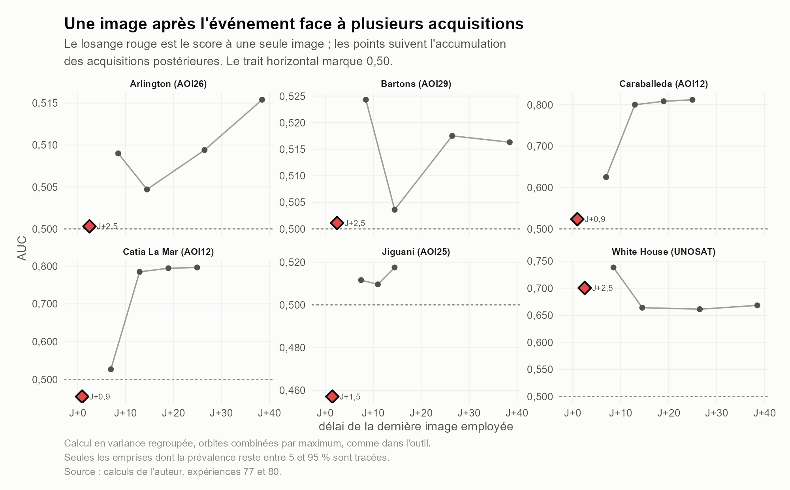

**Figure 5 — Is a single image after the event enough? The red diamond is the score obtained with a single post-event image; the points follow the accumulation of subsequent acquisitions. Computed with pooled variance and orbits combined by maximum, as in the tool; evaluation on Open Buildings in Jamaica and Overture in Venezuela, strict pairing. The figure compares, over ten areas across four countries and two hazard types, the AUC of a single-image z-test with that obtained as the number of post-event images used in the t-test increases from three to nine. The diamonds represent the single-image score; the curves represent the best score available as post-event acquisitions accumulate.**

The results do not show that a single image is systematically sufficient. They show rather that the image's delay matters more than the hazard type. Scores computed from an image acquired less than a day after the event remain close to chance in several areas: 0.465 at Catia la Mar, 0.470 at AOI25 and 0.485 at La Guaira. Conversely, the single images available from about two and a half days after the Jamaican cyclone give AUCs between 0.553 and 0.628; these are close to the performance reached with several post-event images in the same areas.

The Colombian area AOI02 is a different case: a single image at D+4.5 produces an AUC of 0.739, higher than the best value obtained by the multi-image test. This result indicates that a late image may already contain a stabilised and discriminating signal; it is not sufficient, on its own, to establish a general rule.

The operational conclusion is therefore cautious. A first post-event image can provide a useful ranking, but it does not do so immediately or dependably. In the sample studied, the ranking becomes more reliably usable when the single image is acquired about two days after the event. This tendency rests on ten areas only, four distinct delays and several Jamaican areas that share the same orbit; it should be read as an experimental benchmark, not a universal threshold.

The single-image z-test and the multi-image t-test thus answer two different timescales:

- the z-test aims at an early signal, as soon as the first useful image is available;
- the multi-image t-test aims at consolidation, once several acquisitions have made it possible to estimate post-event variability.

### 4.5 How long a reference period before the event?

The pre-event window imposes an analogous trade-off. A short period is close to the disaster, but offers fewer observations and describes ordinary variation less well. A long period strengthens the sample and covers several seasons, at the risk of incorporating older changes or states less comparable with the situation just before the event.

Figure 6 examines this question over the five areas whose prevalence remains between 5 and 95 %, bounds outside which an area under the curve no longer measures anything. The post-event window is fixed at three images, while the pre-event baseline varies from 3 to 24 months: 3, 6, 9, 12, 18 and 24 months.

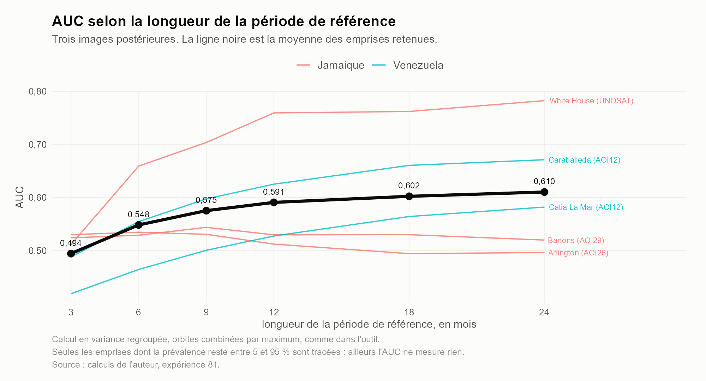

**Figure 6 — How long a baseline? Five areas, those whose prevalence permits an area under the curve. Post window fixed at three images. Sweep over baselines of 3, 6, 9, 12, 18 and 24 months.**

The results do not single out an optimal duration valid everywhere, and the areas separate clearly. Three of them gain a great deal from a longer reference: White House goes from 0.511 at three months to 0.759 at twelve months and then 0.782 at twenty-four; Caraballeda from 0.488 to 0.625 and then 0.671; Catia La Mar from 0.419 to 0.528 and then 0.582. The other two gain nothing: Bartons stays flat, from 0.524 to 0.520, and Arlington declines, from 0.530 to 0.496.

The central tendency does not plateau. The mean of the five areas, drawn in black on the figure, goes from 0.494 with a three-month baseline to 0.591 at twelve months, then keeps rising: 0.602 at eighteen months and 0.610 at twenty-four. In this sample, extending the reference beyond one year therefore still improves the mean ranking, by about two hundredths of AUC between twelve and twenty-four months.

A twelve-month baseline is nonetheless retained by default, for the same reason as the ten-metre radius of the median filter: it is the configuration of the published method, and the tool departs from it on no point. The sweep does indicate, however, that a longer reference would deserve evaluation on a wider sample, and that the gain is not uniformly distributed — it concentrates on the areas with low prevalence, where a short reference period is not enough to describe ordinary variation. The parameter remains adjustable in the tool.

### 4.6 From the statistic to the mapped signal

The result of the test is first of all a raster of continuous values. It is not yet a map of destroyed buildings. It indicates pixels whose backscatter departs unusually from their past behaviour.

Before the statistical computation, the Sentinel-1 images are handled in linear backscatter, then filtered before conversion to logarithm. That order matters: applying a filter to values expressed in decibels would amount to averaging logarithms, which does not have the same statistical meaning as filtering on the linear scale. The Lee filter is used to reduce speckle, the multiplicative noise specific to coherent radar imagery. The configuration applies a 3×3 pixel window and an equivalent number of looks of 5.

To attach the pixel score to a building footprint, the tool can aggregate the pixels covered by that footprint. Ballinger uses the mean. This project's implementation uses the maximum by default, because that aggregation gave an AUC of 0.749 on the Venezuelan earthquake, against 0.726 with the mean. A partly affected building may indeed contain a few strongly anomalous pixels, which the mean dilutes among a set of barely modified ones.

This preference must not, however, be generalised. On the Jamaican cyclone the order between aggregation methods reverses, and the size of the difference is not stable. Aggregation must therefore remain an adjustable parameter of the tool, not a property presented as universally optimal.

Finally, the mapped output must not be mechanically equated with a statistical significance threshold. Ballinger proposes absolute thresholds on T — for example T > 2.7 at n = 40 for a given confidence level within his computational framework. The tool studied here uses thresholds expressed in percentiles instead, in order to stabilise the workload to be reviewed despite seasonal effects. In the trials conducted, an absolute threshold made that workload vary by twelve points between seasons, whereas a threshold expressed as a percentile kept the volume constant.

The operational benefit is clear: asking for "the most suspect 1 %" gives the user a controlled volume of objects to examine. The counterpart is just as clear: a percentile is neither a probability of damage nor a statistical confidence level. It indicates a relative position in the distribution of scores for the area and date considered.

### 4.7 What the method does, and does not, allow one to say

This section thus fixes the status of the output produced. PWTT produces a continuous indicator of anomalous change, computed per pixel from a comparison with the historical behaviour of the radar signal. The result can serve to rank and prioritise buildings or sectors for further analysis.

It does not, on its own, allow one to assert that a building is destroyed, to associate a score with a universal probability of damage, or to turn a threshold into a confidence level, for want of a calibration that would link the value of T to a probability of damage.

This methodological framework now makes it possible to examine two further questions: first, how the signal varies with hazard type and acquisition delay; and second, whether adding interferometric coherence brings information distinct from that of radar intensity.

## 5 Results: delay, signature and aggregation

Operational delay is not merely computation time. It includes waiting for the post-event image, processing it and interpreting the result. A fast method may therefore still be too late if the first usable acquisition arrives several days after the disaster.

A single image can thus provide a first ranking, but not necessarily in the first hours. In the sample studied, acquisitions available around two days after the event are more reliably useful than those arriving within one day. Two questions are examined separately: what this early signal is worth, and what delay must be accepted in order to have several images from the same track.

### 5.1 The image's delay matters more than their number

Eight areas were compared under two configurations:

- a z-score computed on a single later image, available about 2.5 days after the event;
- a t-test computed on three images from the same orbit, the last of which becomes available about 8.5 days after the event.

The comparison therefore addresses a concrete trade-off: obtaining a first result quickly, or waiting for more images in order to characterise the later period better.

The single-image z-score is computed from the difference between the later observation and the historical mean, normalised by the standard deviation of the reference period:

$$z = \frac{x_{\text{post}} - \bar{x}_{\text{pre}}}{s_{\text{pre}}}$$

The multi-image t-test instead uses the means of both periods and their variances:

$$t = \frac{\bar{x}_{\text{post}} - \bar{x}_{\text{pre}}}{\sqrt{\dfrac{s^2_{\text{post}}}{n_{\text{post}}} + \dfrac{s^2_{\text{pre}}}{n_{\text{pre}}}}}$$

The first score is therefore available earlier, but with a single later observation. The second benefits from an estimate of post-event variability, but requires several passes of the same orbit.

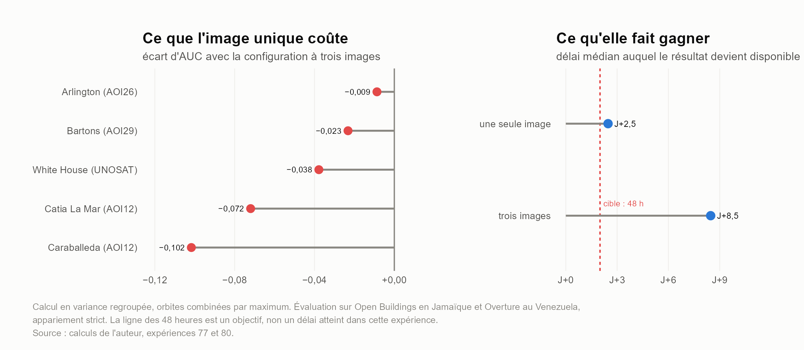

**Figure 7 — A single image after the event: the trade-off, quantified. On the left, what the single image costs area by area (AUC of the 1-image z-score against the 3-image Welch test). On the right, what moving from one to three images costs in delay: 2.5 days against 8.5 days, for an operational target of 48 hours.**

The figure shows that the single image does not systematically produce the better ranking. At AOI02, for example, the z-score obtains an AUC of about 0.74, while Welch's test reaches about 0.72. Conversely, in several areas the use of three later images slightly improves the ranking. The differences nonetheless remain limited and vary from area to area.

The gain from the multi-image test must be set against its cost in time. In the experiment shown on the right, moving from one image to three delays the result from about 2.5 days to about 8.5 days. The additional delay is therefore of the order of six days, whereas the improvement in AUC is neither systematic nor large enough to justify that wait automatically in a first-assessment situation.

For a cell that must act within 24 to 48 hours, the single-image score is the one compatible with the deadline. It should be presented as a first indicator, then enriched or corrected as subsequent acquisitions become available.

The multi-image test retains its interest for a consolidation phase. It can confirm or qualify the first ranking, particularly when the first image is affected by an atypical observation, a residual weather condition or a local variation that is hard to interpret. The chain should therefore be designed as progressive:

1. produce a first signal as soon as a usable post-event image is available;

2. compare it with the historical reference;

3. update the ranking as new images arrive;

4. confront the priority sectors with optical imagery, aerial observation or field information.

Radar therefore does not replace detailed assessment; it makes it possible to begin ranking sectors before that assessment is available.

### 5.2 Does the method transfer to cyclones, earthquakes and debris flows?

The figure compares two visibly heavily damaged buildings after different disasters. At Black River, after Cyclone Melissa, radar backscatter falls; at Catia La Mar, after the earthquake of 24 June 2026, it rises. It would nevertheless be wrong to assign a sign to each disaster type: other buildings studied after Melissa show an increase, and other buildings studied after the earthquake show a decrease. The plate therefore illustrates a property of the method — looking for change in both directions — and not a signature specific to the cyclone or the earthquake.

At Black River the later images show the roof gone and debris around the building; UNOSAT had flagged it as damage to be assessed. For orbit 150, mean backscatter goes from +0.98 dB before the cyclone to −8.34 dB after, i.e. −9.32 dB. The break persists in the following acquisitions. The other orbit covering the site shows no comparable fall. This difference between look directions is consistent with the loss of a reflection mechanism tied to the geometry of a façade, without allowing that mechanism to be identified with certainty.

At Catia La Mar the building is classified *Destroyed* by Copernicus EMS. The variation observed on orbit 25 is the opposite: the mean goes from −13.0 dB to −8.8 dB, i.e. +4.22 dB. A change in the roughness and arrangement of materials after the collapse may contribute to that rise. Here again the radar image measures the change in the scene; it does not say, on its own, which part of the building produced it.

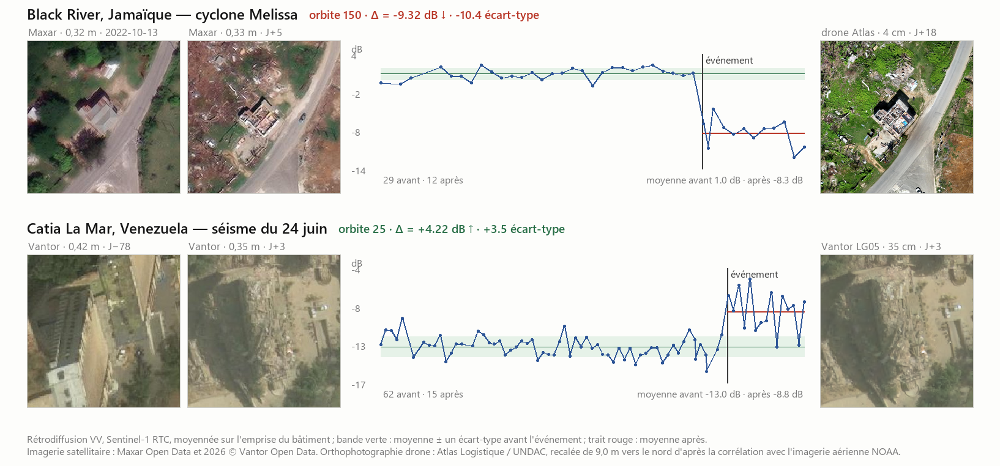

**Figure 8 — Two heavily damaged buildings, two directions of radar change.** Top, Black River after Cyclone Melissa: −9.32 dB on orbit 150. Bottom, Catia La Mar after the earthquake of 24 June 2026: +4.22 dB on orbit 25. The curves show VV backscatter before and after each event; the green band represents the mean and one standard deviation of the earlier period, the red line the later mean. Sources: author's calculations; Maxar Open Data imagery and 2026 © Vantor Open Data; orthophotograph Atlas Logistique / UNDAC.

These examples justify the use of the absolute value: neither a rise nor a fall can be ruled out a priori. They do not demonstrate that all cyclones and earthquakes are detected with the same reliability. At building scale, interpretation still depends on the orbit, the resolution and what the pixel includes around the structure. Comparison with imagery and field observation remains indispensable.

**Interpretative hypothesis.** At Black River, the strong fall in backscatter on orbit 150, absent on orbit 113, is consistent with the loss of a double bounce between a façade facing the radar and the ground. The persistence of the fall several months after the cyclone makes the hypothesis of a merely temporary sheet of water less convincing. Neither observation, however, allows the signal to be attributed with certainty to the façade: the pixels also cover the building's surroundings, and other surface changes can alter backscatter. At Catia La Mar the rise could, conversely, be linked to surfaces that became rougher after the collapse, notably rubble. That explanation too remains a hypothesis, and not a direct identification of materials by Sentinel-1.

A third disaster, of a different type again, was examined. On 26 August 2026 a sudden glacial lake outburst triggered a debris flow in the districts of Rasuwa and Nuwakot, in Nepal — Copernicus activation EMSR927. The destruction mode here is neither wind nor shaking: the flow carries away and buries, and it transforms the entire scene along its path.

The terrain there is moreover extreme. The area's median slope reaches 32.7 degrees, and 28.5 % of the ground exceeds 39 degrees, Sentinel-1's incidence angle; beyond that, the radar folds the relief onto itself and the pixel no longer measures a stable surface. The method nonetheless works there, and better than on the other two hazards — the area under the curve reaches 0.85 to 0.90 on roads and bridges, as section 5.6 reports. This result should be read not as a superiority of radar in mountains, but as the effect of a hazard that modifies the whole of the surface it crosses.

The first usable Sentinel-1 image arrives at D+2.52, that is, at the same delay as in Jamaica. This campaign therefore says nothing about the delay threshold examined in section 5.1; it speaks to transfer to a third destruction mode.

### 5.3 Effect of the aggregation mode in the cases studied

The score is computed per pixel, but the object evaluated is the building. The values contained in each footprint must therefore be summarised without losing the kind of signal one is trying to preserve. Several options were compared:

- the mean of the pixels;
- the maximum;
- the 75th percentile;
- the 90th percentile.

If Tᵢ denotes the score value for pixel i belonging to a building, the main aggregations are written:

$$T_{\text{mean}} = \frac{1}{m} \sum_{i=1}^{m} T_i$$

$$T_{\max} = \max_{1 \le i \le m} T_i$$

The percentiles T₇₅ and T₉₀ are respectively the values below which 75 % and 90 % of the footprint's pixel scores lie.

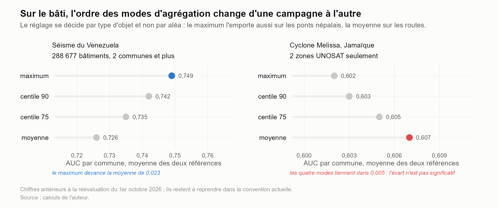

**Figure 10 — On buildings, the ordering of aggregation modes changes from one campaign to the next.** On the left, the Venezuela earthquake, evaluated over 288,677 buildings across two municipalities or more: the maximum leads the mean by 0.023. On the right, Cyclone Melissa in Jamaica, over two UNOSAT areas only: the four modes lie within 0.005, and the difference is not significant. The setting is therefore decided by object type and not by hazard — the maximum also wins on the Nepalese bridges, the mean on the roads, across both measurable campaigns. The values are shown as points rather than bars: a bar is read by its length and should start at zero, which an axis zoomed to five thousandths cannot allow. These figures predate the re-evaluation of 1 October 2026 and remain to be redone under the current convention. Author's calculations.

In the Venezuelan sample, which comprises 288,677 buildings across at least two municipalities, the maximum obtains the highest AUC: 0.749. It is followed by the 90th percentile at 0.742, the 75th percentile at 0.735, then the mean at 0.726.

The maximum appears here to favour the detection of buildings only part of whose footprint is strongly modified. If a building collapses partially, a few pixels may carry most of the signal, whereas the footprint mean dilutes those values among pixels that have remained relatively stable.

Jamaica gives a slightly different result. Over the two UNOSAT areas available, the mean reaches 0.607, ahead of the 75th percentile (0.605), the 90th percentile (0.603) and the maximum (0.602). The gap between the best and worst method is only 0.005, and it is marked as not significant in the figure.

This ordering therefore does not support adopting a universal aggregation. The maximum is favourable for the earthquake studied, but the mean is slightly better on the Jamaican cyclone. That difference may be explained by the spatial nature of the damage. An earthquake can produce localised changes within a building's footprint, whereas a cyclone can affect the roof, the surroundings, the vegetation and neighbouring surfaces more broadly. In the latter case a mean may represent the general change better than a single extreme pixel.

Aggregation must therefore remain adjustable. It would be methodologically incorrect to choose the maximum because it produces the best score on Venezuela, and then to present that choice as valid for all events. The result argues rather for a scenario-by-scenario analysis and a systematic comparison of aggregations.

This ordering does not transfer to linear objects, and that is a result in itself. On the Nepalese bridges it holds intact — the maximum wins, then the 90th percentile, the 75th and the mean. On roads it reverses exactly, and it reverses on both campaigns where measurement is possible: some five hundred segments in Nepal, three thousand in Jamaica. In all four cases the progression is strictly monotonic, which rules out a sampling accident.

A mechanical explanation accounts for it. The maximum of *n* noisy values grows with *n*: the more pixels an object covers, the more likely it is to contain a single abnormally bright one, which the maximum then raises as a false alarm. A building covers one to four ten-metre pixels, a bridge a few, a road segment ten to twenty. The competing hypothesis — that length alone governs — was tested and the data refuse it, but the only case that seemed to support it counts no more than twenty usable segments.

The stakes are not of the same order depending on the object: one hundredth of AUC on a building, five in Nepal and seven in Jamaica on a road. The recommendation is therefore to set aggregation **by object type** — maximum for buildings and bridges, mean for roads — rather than to derive it automatically from the measured size of objects, which would make the setting swing with the noise.

### 5.4 What the sources really allow one to validate

Plates A and B also show that validation does not consist in seeking an artificial agreement between all sources. Each source observes neither exactly the same object nor at the same scale:

- very high resolution optical imagery describes the building's shape and visible state directly;
- radar measures a change in backscatter or in coherence;
- Copernicus or UNOSAT products provide a classification made by analysts;
- ChatMap reports document a field observation, sometimes located nearby rather than on the exact centroid;
- OSU, NASA, EOS-RS and other products correspond to their own methods and areas.

In the Black River case, convergence is strong: the UNOSAT classification, the optical imagery, the aircraft, the drone and the radar signal all describe a major change. In the Caraballeda case, convergence is more qualified: several sources indicate a damaged building, but the field report is offset by 12.5 m and Copernicus does not retain the building. The radar indicates a clear change, but does not on its own settle the question between the targeted building and its immediate neighbour.

This distinction matters in order to avoid an overstatement. A source absent from the area is not a source that concludes there is no damage. It may simply not cover the point, not have analysed that area, or have adopted a different spatial unit. Validation therefore concerns the signal, its location and the status of the source all at once.

### 5.5 Operational consequence

These results lead to an intermediate position. The method can produce a first indicator within a window compatible with first assessments, but it must not be described as an automatic and definitive mapping of damaged buildings.

In an operational scenario, the most defensible output is a continuous ranking of footprints or sectors:

- the objects showing the most atypical variations are examined first;
- the optical imagery available is mobilised to confirm the nature of the change;
- aerial assets or field observations are directed towards the sectors where the decision is most urgent;
- subsequent radar acquisitions serve to update or consolidate the ranking.

The method is therefore useful mainly as a prioritisation tool. Its value lies not in a promise to replace the expert, but in the possibility of rapidly providing a first ordering when the detailed optical image is absent, late or incomplete.

The following section examines whether adding interferometric coherence improves that ordering. The Caraballeda case already shows that coherence can reveal a temporal break where intensity evolves ambiguously. It remains to be checked, at the scale of a set of buildings, whether this information brings a genuinely complementary ranking capability or whether it mainly reproduces the limitations of the intensity signal.

### 5.6 The t-test applied to roads and bridges

Sections 3.3 and 3.4 identified a gap: the road network is little addressed by damage detection methods, although a severed road and a washed-out bridge govern the access of relief as much as a collapsed building does. The tool developed here already produces an output for both, but it had never been possible to quantify it. The Copernicus ground truth for the Venezuelan earthquake contains only three damaged roads out of 24,696 graded features: with three positives, no quality measurement is possible.

The Nepalese debris flow removes that obstacle, and it brings more than a larger sample. Copernicus there explicitly records the segments with "no visible damage", and the Humanitarian OpenStreetMap team mapped and then graded each bridge, standing or washed out. **The negatives are therefore asserted by an analyst, not inferred from an absence of reporting** — which distinguishes this measurement from all the building evaluations in this work, where an unreported building is assumed intact for want of anything better.

| object | area | objects | prevalence | full series | single image |
|---|---|---|---|---|---|
| bridges | all areas, HOT | 76 | 59.2 % | **0.885** | 0.826 |
| roads | Bidur (AOI03) | 523 | 51.6 % | **0.899** | 0.770 |
| roads | Phosretar (AOI05) | 489 | 31.9 % | **0.849** | 0.794 |
| roads | Syapru Besi (AOI01) | 20 | 70.0 % | 0.810 | 0.774 |

**Table 4 — Ranking power of the t-test on the roads and bridges carried away by the debris flow of 26 and 27 August 2026. The negatives are declared by the analyst. The single image is the one at D+2.5. Aggregation by mean for roads, by maximum for bridges. Author's calculations.**

These values exceed those measured on buildings, where this work lies between 0.50 and 0.83. A linear object is extended and well localised, and a flow carries it away unambiguously, whereas a collapsed building may backscatter more or less than before depending on its geometry. With the first image alone, acquired at D+2.5, the ranking remains useful: between 0.77 and 0.86 depending on the object.

Two caveats nonetheless limit the reach of this result. Both ground truths are photo-interpretations and not field surveys; they are not two independent sources in the sense that a visit would be. And prevalence is high, from 32 to 77 %, because a flow destroys everything in its path — the ranking task is easier there than after an earthquake, where damage is scattered.

A more serious limitation must finally be stated plainly. On the Jamaican cyclone the four aggregation modes place the area under the curve between 0.29 and 0.36, that is, **below chance**: the ranking there is inverted. The same tool reaches 0.85 in Nepal. Changing the aggregation makes no difference. Until that inversion is understood, the road output cannot be presented as damage detection, but only as a flagging of segments whose surface has changed.

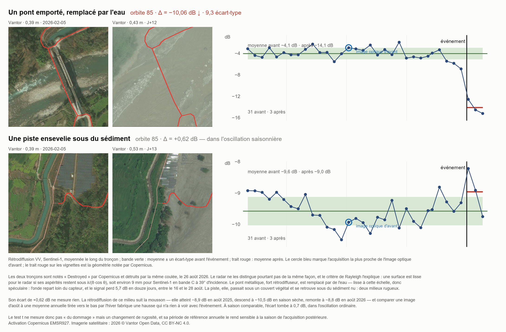

**Figure 17 — What the t-test sees, and what it does not.** Two segments destroyed by the same debris flow, on 26 August 2026, and both graded *Destroyed* by Copernicus. The Rayleigh criterion separates their fates: a surface is smooth for the radar if its asperities stay below λ/(8·cos θ), i.e. about 9 mm for Sentinel-1 in C band at 39° incidence. The steel bridge, a strong backscatterer, is replaced by water — smooth at that scale, hence specular: the signal loses 5.7 dB in twelve days. The track, by contrast, ran under a vegetation canopy and ends up under bare sediment, two rough media that return as much as one another; its difference of +0.62 dB measures nothing, and owes more to the monsoon than to the flow. Imagery: 2026 © Vantor Open Data, CC BY-NC 4.0. Author's calculations.

This plate carries a consequence that must be stated. **The t-test does not measure damage but a change in surface roughness.** It is blind when destruction substitutes one rough medium for another, even when the damage is total and plain to the naked eye — a frequent situation in mountain valleys, where vegetation gives way to coarse deposits. The areas under the curve obtained above are therefore driven by the cases where the roughness contrast is strong.

A second bias appears in this campaign. Since the reference period covers twelve months, it mixes seasons; yet the backscatter of these media follows the monsoon, from −8.9 dB in August to −10.5 dB in the dry season. Comparing an August image with that annual mean manufactures a difference that owes nothing to the event. Under a monsoon climate, the acquisition date of the post-event image therefore weighs on the result as much as the damage itself.

## 6 Comparing methods on the same objects

Comparing methods makes sense only if they are evaluated on the same objects, with the same references and the same metric. A comparison over different areas may in fact favour the method that happened to process the easier sector.

The question is therefore not only "which method obtains the best AUC?", but also "on which buildings was that AUC computed?".

### 6.1 Why compare over a common footprint?

A first reading evaluates each product over its own area. It describes what the user actually receives, but does not allow the methods to be compared directly: the buildings, the prevalence of damage and the difficulty of interpretation may differ.

The common-footprint experiment therefore restricts the comparison to the buildings covered by the methods evaluated. AUCs are computed per municipality, after centring and scaling within each administrative unit, then aggregated to obtain a comparable mean value.

This precaution matters here, because the T-stat's coverage is not uniform across the activation. In the areas computed it exceeds 95 %, but the tool did not process every area available. Comparing over a common footprint therefore makes it possible to separate two questions:

- which method best ranks the buildings it covers;
- what coverage and what product are actually available to the user.

Ranking power and coverage must therefore be kept apart. A method may perform well over a restricted area, while another covers more buildings with somewhat different performance.

### 6.2 The ranking over the common footprint

The intersection of the wide-area products represents 148,159 buildings and 1,558 Copernicus reports across 20 municipalities. The resulting ranking is:

| Rank | Product | AUC / Copernicus | AUC / ChatMap | Mean |
|---|---|---|---|---|
| 1 | Our T-stat | 0.727 | 0.754 | 0.740 |
| 2 | OSU | 0.729 | 0.735 | 0.732 |
| 3 | NASA DRCS S2 | 0.713 | 0.719 | 0.716 |
| 4 | UNGSC | 0.651 | 0.600 | 0.625 |
| 5 | fAIr HOTOSM | 0.594 | 0.631 | 0.612 |
| 6 | UH SAIL | 0.658 | 0.469 | 0.563 |
| 7 | NASA DRCS S1 | 0.511 | 0.544 | 0.528 |
| 8 | IMPACT Initiatives | 0.496 | 0.487 | 0.491 |

Ranking over the footprint common to the wide-coverage products (148,159 buildings, 20 municipalities).

Rank is established on the mean of the two references:

AUC_mean = (AUC_Copernicus + AUC_ChatMap) / 2

This mean does not mean that Copernicus and ChatMap describe the same truth. Copernicus corresponds to expert interpretation of imagery, whereas ChatMap corresponds to reports from the field. The two references are used here as two independent viewpoints on damage, not as interchangeable observations.

The T-stat comes first with 0.740, ahead of OSU (0.732) and NASA DRCS S2 (0.716). The three values remain close: 0.024 separates the first from the third. The result therefore establishes a first place within this protocol, not a general superiority.

The order is not the same when each product is evaluated over its own area: the T-stat moves from third place to first, while NASA DRCS S2 moves from first to third. The evaluation footprint therefore contributes strongly to the ranking.

Wide-area products can obtain a high AUC by including lightly affected municipalities or areas where the separation between damaged and intact buildings is simpler. The common footprint, by contrast, is concentrated on the sectors covered by all products, and hence on areas where the comparison is more demanding. Part of the lead observed for NASA DRCS S2 and OSU in the individual ranking could therefore come from the territory evaluated rather than from the quality of the method alone.

### 6.3 Head to head on the same buildings

A second reading consists in comparing our T-stat directly with each product, retaining only the buildings covered by both methods. Each opponent is thus evaluated over a footprint shared with our tool.

| Opponent | Common bldgs | T-stat / Cop. | Opp. / Cop. | T-stat / ChatMap | Opp. / ChatMap |
|---|---|---|---|---|---|
| OSU | 288,208 | 0.717 | 0.756 | 0.780 | 0.755 |
| NASA DRCS S2 | 173,381 | 0.735 | 0.724 | 0.778 | 0.748 |
| BDPM (reproduction) | 80,291 | 0.735 | 0.746 | 0.788 | 0.738 |
| UNGSC | 180,268 | 0.736 | 0.671 | 0.780 | 0.627 |
| EOS-RS | 29,641 | 0.689 | 0.631 | 0.787 | 0.689 |
| UH SAIL | 170,472 | 0.718 | 0.629 | 0.756 | 0.473 |
| fAIr HOTOSM | 197,582 | 0.727 | 0.583 | 0.791 | 0.651 |
| Microsoft AI for Good | 67,145 | 0.749 | 0.591 | 0.828 | 0.620 |
| NASA DRCS S1 | 180,148 | 0.736 | 0.506 | 0.780 | 0.557 |
| IMPACT Initiatives | 204,979 | 0.727 | 0.506 | 0.780 | 0.512 |
| DISHA | 32,834 | 0.722 | 0.373 | 0.879 | 0.415 |

Head-to-head comparison: our T-stat against each product, over the buildings covered by both methods only.

In these head-to-heads the T-stat obtains a higher AUC than nine products out of eleven. OSU and the BDPM reproduction are the exceptions, but neither exceeds it on both references simultaneously.

This result does not mean that the T-stat is systematically better: the products use neither the same quantities, nor the same data, nor necessarily the same definition of damage. It shows that it provides a competitive ranking on the common buildings.

The head-to-head with IMPACT Initiatives is particularly instructive. Over 204,979 common buildings, our T-stat reaches 0.727 against Copernicus and 0.780 against ChatMap, while IMPACT reaches 0.506 and 0.512 respectively. Over this common footprint the IMPACT product is therefore indistinguishable from chance according to these two references.

This observation must nonetheless remain confined to the protocol studied. It does not support the conclusion that the IMPACT product is worthless in all contexts, only that it does not correctly discriminate the buildings of this sample according to the two ground truths used.

### 6.4 Comparing only the buildings present in every product

A third experiment requires all twelve products to cover the same buildings simultaneously. The sample falls to 5,489 buildings, 329 Copernicus reports and five municipalities.

| Rank | Product | AUC against Copernicus |
|---|---|---|
| 1 | Our T-stat | 0.715 |
| 2 | NASA DRCS S2 | 0.696 |
| 3 | BDPM | 0.679 |
| 4 | fAIr HOTOSM | 0.644 |
| 5 | EOS-RS | 0.617 |
| 6 | UNGSC | 0.608 |
| 7 | IMPACT Initiatives | 0.605 |
| 8 | Microsoft AI for Good | 0.558 |
| 9 | OSU | 0.548 |
| 10 | NASA DRCS S1 | 0.526 |
| 11 | UH SAIL | 0.465 |
| 12 | DISHA | 0.410 |

Ranking over the strict intersection of the twelve products (5,489 buildings, 5 municipalities, prevalence ≈ 6 %).

The T-stat remains first, but this reading is secondary. The sample is too small and the common area is determined by the three products with the smallest footprints. The prevalence of damaged buildings there reaches about 6 %, against 0.28 % over the activation as a whole.

OSU's collapse to 0.548 may suggest that coherence discriminates less well in an area where damage is very widespread and spatially concentrated. If coherence is degraded over a large part of the area, it may lose its capacity to distinguish genuinely affected buildings from their neighbours. This interpretation nonetheless remains a hypothesis: five municipalities are not enough to establish it.

### 6.5 What can be concluded from the ranking?

Three conclusions can be drawn.

First, the ranking carried out over each product's own area remains useful for describing the results actually delivered to users. It does not, however, answer the question "which method is best?", because the methods are not evaluated on the same buildings.

Second, over the common footprint our T-stat obtains the best mean between Copernicus and ChatMap, ahead of OSU and NASA DRCS S2. The three methods remain close, which calls for cautious interpretation.

Third, publishing both rankings is preferable to publishing only one. The individual ranking measures performance within the territory processed by each producer; the common ranking measures more directly the difference between methods at comparable territory. Both pieces of information are needed in order to assess both the quality of the signal and the coverage actually available.

This comparison supports the decision not to present the T-stat as a tool for definitive classification. Its value is that of an open, reproducible and competitive method, able to produce a continuous score over a chosen area, and therefore to be evaluated and compared transparently.

The following section examines whether the results can be improved by combining several products or several radar quantities, notably intensity and coherence. That step must, however, respect an essential rule: the weights or fusion rules must not be chosen on the same ground truth as the one used to announce the final performance. Otherwise the method would be marking its own work.

## 7 What the evaluation footprint changes in the ranking

The previous section compared products over a common footprint. Here the aim is different: to measure the extent to which the evaluation perimeter alters the ranking.

The ranking depends in part on the buildings evaluated. Each method is therefore compared under two configurations:

- first over its own area, that is, over the buildings actually covered by the product;
- second over the footprint common to the methods compared, i.e. 148,159 buildings.

In both cases the indicator presented is the mean of the AUCs computed per municipality for the two references available, Copernicus EMS and ChatMap:

AUC_mean = (AUC_Copernicus + AUC_ChatMap) / 2

This mean does not turn Copernicus EMS and ChatMap into a single truth. It summarises two distinct evaluations: one based on image interpretation, the other on field reports.

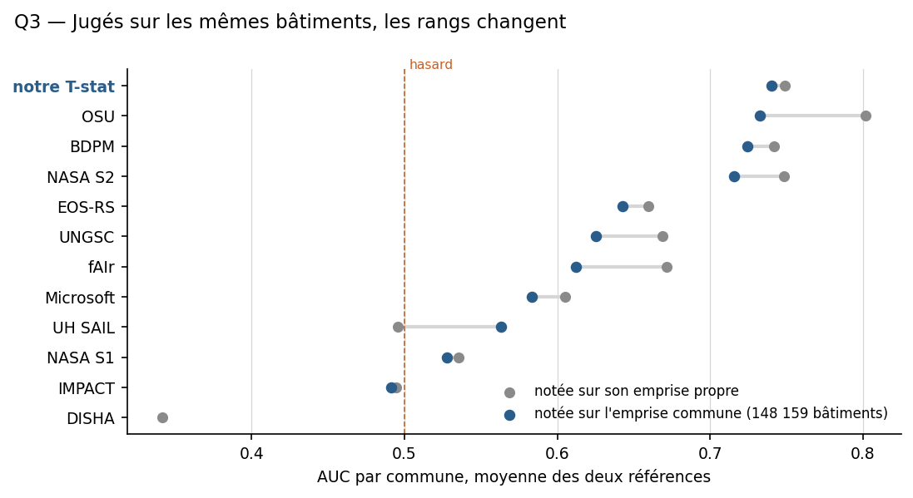

**Figure 11 — Judged on the same buildings, the ranks change. Each product is shown twice: scored on its own area (grey) and scored on the common footprint of 148,159 buildings (blue). The dotted line marks the level of chance (0.5). Our T-stat, in the lead, is the only product whose score barely varies between the two configurations.**

The figure shows that these two modes of evaluation do not always give the same ranking. The T-stat obtains a very similar value in both configurations, around 0.74. By contrast, OSU reaches about 0.80 when evaluated over its own area, but about 0.73 over the common footprint. NASA DRCS S2 follows the same pattern: its score goes from about 0.78 over its own area to about 0.72 over the common buildings.

These differences do not prove that a product intrinsically loses performance over the common footprint. They show first of all that the products' own areas do not all present the same level of difficulty. A product evaluated mainly over sectors where damage is more visible, or more easily separable from intact buildings, can obtain a high AUC without that reflecting the quality of its algorithm alone.

The common footprint therefore sometimes changes the ranking. Our T-stat, which is not first when evaluated under each product's own protocol, comes first when all methods are judged on the same buildings. OSU and BDPM remain close, while several other products move appreciably in the ranking.

The case of OSU is particularly instructive. Its own AUC is high, around 0.80, but falls to about 0.73 over the common footprint. That drop indicates that its performance depends strongly on the territory covered in its own evaluation. The product remains competitive, but its initial rank cannot be interpreted independently of its area.

The T-stat's relative stability between the two configurations suggests a lesser dependence on the selection of buildings. It does not demonstrate general superiority, but it makes the result more stable in this experiment.

The vertical line at 0.5 represents the level of chance. Methods to the right of that line discriminate between buildings classified positive and negative better than a random ranking would. Products close to 0.5, like IMPACT in the common comparison, do not by contrast provide a useful ranking on this sample.

### 7.1 Own footprint, common footprint and strict intersection: three different evaluations

The two evaluations answer different questions.

The ranking over a product's own area answers the question:

"What performance does the product deliver over the territory it chose, or actually processed?"

It is useful for assessing the offering genuinely available to a user. It implicitly takes account of coverage, masking, production choices and the areas retained by the supplier.

The ranking over the common footprint answers a different question:

"Which method best ranks the same buildings, once differences of territory are neutralised?"

It is better suited to algorithmic comparison, but it necessarily reduces the sample to the areas covered by all the products considered.

Neither ranking should be presented alone. Publishing only the ranking over own areas would favour the methods evaluated over the most favourable territories. Publishing only the common ranking would hide an important operational fact: a product may achieve good performance over the common footprint while covering very few buildings in a real situation.

A complete comparison must therefore present simultaneously:

- performance over the own footprint;
- performance over the common footprint;
- the number of buildings covered;
- the number of positives available for validation.

### 7.2 A consequence for interpreting the AUC

The AUC measures ranking power, not a probability of damage. It can change when the population evaluated changes, even if the algorithm stays identical.

Formally, the AUC can be interpreted as the probability that a positive building receives a higher score than a randomly drawn negative building:

AUC = P( S⁺ > S⁻ )

where S⁺ denotes the score of a positive building and S⁻ that of a negative one.

This explains why two AUCs computed over different areas are not directly comparable. The score distributions, the proportion of positives, the nature of the damage and the observation conditions may all change.

The common footprint does not make the comparison perfect, but it removes a major source of difference: the methods are evaluated on the same buildings and against the same references.

### 7.3 The limit of this experiment

The common footprint is not necessarily a representative sample of all the buildings in the activation. It corresponds to the buildings covered simultaneously by the methods compared. Products with small areas can therefore reduce the intersection to a particular zone, sometimes closer to the disaster's core than the rest of the territory.

This limitation is visible in the strict intersection of the twelve products: the sample falls to 5,489 buildings spread over only five municipalities. The result confirms the T-stat's good ranking, but it cannot be used as a general validation because of the small footprint and the reduced number of municipalities.

The experiment therefore does not support the claim that the T-stat is better in every context. It supports something more precise: when several methods are compared on the same buildings, the resulting ranking can be very different from the one produced by their own areas; in the sample studied, the T-stat becomes the best of the products compared according to the mean of the two references.

This conclusion justifies presenting both readings. Above all it is a reminder that a ranking of detection methods is never independent of the territory over which it is computed.

### Transition to the following section

The common-footprint comparison places our T-stat among the most competitive methods, but it does not yet answer the question of whether several signals can be combined. The following section therefore examines the fusion of the T-stat's radar intensity with methods based on interferometric coherence. The aim is to determine whether these two quantities bring complementary information, and not merely to produce a more complex score.

## 8 Fusing sources: the gain depends on the use

The previous sections compared products as alternatives. This section treats them as complementary sources: the question becomes the gain brought by their combination, and the rule most useful for the intended use.

Radar intensity and interferometric coherence do not rank exactly the same buildings. That difference can be exploited, provided the fusion genuinely improves the ranking rather than merely adding complexity.

The aim is therefore to check whether two partly different radar signals rank buildings better than either taken alone.

### 8.1 Principle of the fusion

The products do not necessarily provide scores comparable on a single scale. Before fusion, each score is therefore converted into a normalised rank within each municipality and each product.

For a building i, if rᵢ,ₖ denotes the normalised rank assigned by product k, the simple mean of K products is:

$$F_{\text{mean}} = \frac{1}{K} \sum_{k=1}^{K} r_{i,k}$$

For two products, the T-stat and a coherence method, this expression becomes:

$$F_{\text{mean}} = \frac{r_{i,T} + r_{i,\text{coh}}}{2}$$

A weighted mean can also be computed:

$$F_{\text{weighted}} = \frac{w_T\,r_{i,T} + w_{\text{coh}}\,r_{i,\text{coh}}}{w_T + w_{\text{coh}}}$$

The weights are proportional to performance in excess of chance, that is:

$$w_k \propto \bigl( \mathrm{AUC}_k - 0.5 \bigr)$$

The weights are computed with the other reference: performance measured against Copernicus sets the weights evaluated against ChatMap, and vice versa. This separation limits the risk of tuning the fusion directly on the ground truth used to test it.

Two alternative rules were also tested: conjunction, which retains the lower score,

$$F_{\text{AND}} = \min\bigl( r_{i,T},\; r_{i,\text{coh}} \bigr)$$

and disjunction, which retains the higher score,

$$F_{\text{OR}} = \max\bigl( r_{i,T},\; r_{i,\text{coh}} \bigr)$$

Disjunction follows an alerting logic: one source is enough. Conjunction follows a confirmation logic: both sources must point the same way.

### 8.2 The targeted fusion of the T-stat and coherence

The main experiment concerns the fusion of the T-stat with OSU, a coherence-based product, over a common footprint of 148,159 buildings across 20 municipalities.

| Score | AUC Copernicus | AUC ChatMap | Mean |
|---|---|---|---|
| T-stat × OSU fusion, weighted mean | 0.752 | 0.775 | 0.764 |

| T-stat × OSU fusion, simple mean | 0.752 | 0.775 | 0.763 |
| T-stat × OSU fusion, conjunction | 0.741 | 0.777 | 0.759 |
| Our T-stat alone | 0.727 | 0.754 | 0.740 |
| OSU alone | 0.729 | 0.735 | 0.732 |
| NASA DRCS S2 alone | 0.713 | 0.719 | 0.716 |
| T-stat × OSU fusion, disjunction | 0.700 | 0.694 | 0.697 |

T-stat × OSU fusion over the common footprint (148,159 buildings, 20 municipalities), compared with the products taken separately.

In this experiment the fusion improves the ranking relative to each of the two products taken separately. Relative to the T-stat alone, the mean gain is:

ΔAUC = 0.7635 − 0.7403 = 0.0232

Relative to OSU alone, the gain is:

ΔAUC = 0.7635 − 0.7324 = 0.0311

The gain appears against both references, which is more convincing than a gain observed against a single source. It remains, however, tied to this footprint and this protocol.

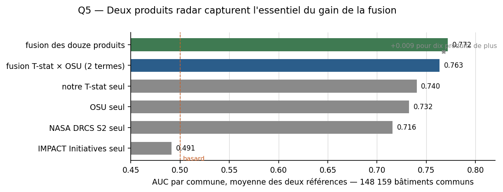

**Figure 12 — Two radar products capture most of the fusion's gain. The fusion of all twelve products (0.772) and the two-term T-stat × OSU fusion (0.763) remain close, far ahead of each product taken alone.**

The broad fusion of twelve products obtains a mean AUC of 0.7720. The T-stat × OSU fusion reaches 0.7635. The gap between the two is therefore only:

0.7720 − 0.7635 = 0.0085

The gain of the T-stat alone relative to its initial value is 0.0232, whereas the gain of the twelve-product fusion is:

0.7720 − 0.7403 = 0.0317

In this comparison the two-term fusion therefore recovers about:

(0.0232 / 0.0317) × 100 ≈ 73 %

of the gain obtained with twelve products. That proportion matters for operational use: two free radar sources, available within a manageable processing chain, capture most of the improvement obtained by a far heavier fusion.

### 8.3 The mean is preferable to disjunction

The three fusion rules do not produce the same result.

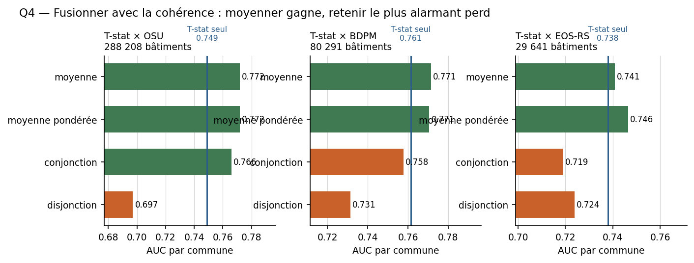

**Figure 13 — Fusing with coherence: averaging wins, taking the most alarming loses. On the three pairs tested (T-stat × OSU, × BDPM, × EOS-RS), the mean and the weighted mean (in green) systematically exceed the T-stat alone; conjunction and disjunction (in orange) stay below it.**

The simple mean and the weighted mean give almost the same result: 0.7632 against 0.7635, i.e. less than 0.001 apart. Tuning the weights therefore brings a negligible gain in this configuration.

Conjunction obtains a slightly lower value, 0.7588, but remains close to the mean. It implicitly demands confirmation by both methods and therefore reduces part of the false alarms, at the cost of some sensitivity.

Disjunction strongly degrades the ranking: its mean AUC is 0.6966, below the T-stat alone, below OSU alone and below their mean. It does in fact pass on the false positives specific to each method.

Disjunction produces the following losses relative to the T-stat alone:

| Configuration | T-stat alone | Disjunction | Difference |
|---|---|---|---|
| T-stat × OSU, common footprint | 0.7403 | 0.6966 | −0.0437 |
| T-stat × OSU, own footprint | 0.7489 | 0.6971 | −0.0518 |
| T-stat × BDPM | 0.7613 | 0.7313 | −0.0300 |
| T-stat × EOS-RS | 0.7379 | 0.7238 | −0.0141 |

Cost of disjunction (taking the more alarming verdict) relative to the T-stat alone, over four configurations.

The rule of retaining the most alarming signal may seem prudent, but it confuses prudence with the accumulation of false positives. Where verification capacity is limited, it may above all increase the number of addresses to examine without improving the ranking of the buildings genuinely affected.

### 8.4 The gain is confirmed with several partners

The fusion does not rest on the T-stat × OSU case alone. Analogous experiments were carried out with three coherence partners, each over its respective common footprint.

| Pair | Buildings | T-stat alone | Partner alone | Best fusion | Gain |
|---|---|---|---|---|---|
| T-stat × OSU | 288,208 | 0.749 | 0.755 | 0.772 | +0.017 |
| T-stat × BDPM | 80,291 | 0.761 | 0.742 | 0.772 | +0.010 |
| T-stat × EOS-RS | 29,641 | 0.738 | 0.660 | 0.746 | +0.009 |
| T-stat × three partners | 13,832 | 0.743 | — | 0.757 | +0.014 |

Gain from fusion with three distinct coherence partners, each over its common footprint with the T-stat.

The gain is positive in all four configurations. It remains modest, between about one and two hundredths, but it holds up despite changes of partner and of footprint.

Coherence is therefore not always better than intensity; in two configurations the partner alone performs less well. The gain comes from the complementarity of the signals and of their errors, not from a general superiority of one source.

### 8.5 Two uses, two decision rules

A single AUC is not enough to describe operational usefulness. Two uses may lead to different settings:

1. sending teams to the most suspect buildings;

2. sweeping an area as widely as possible without missing too many affected buildings.

These two objectives do not imply the same selection rule.

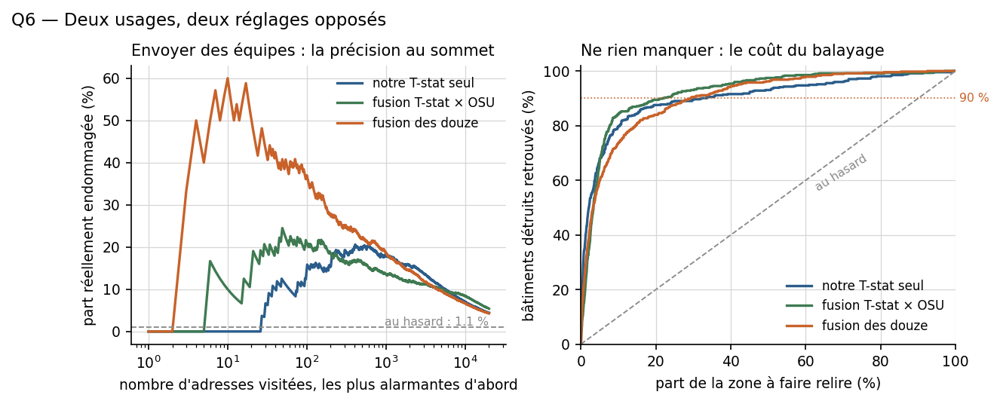

**Figure 14 — Two uses, two opposite settings. On the left, precision at the top of the ranking (sending teams): the twelve-product fusion clearly dominates in the first ranks. On the right, cumulative recall against the share of the area reviewed (missing nothing): the T-stat × OSU fusion reaches 90 % recall for a smaller share of the area to review than the T-stat alone.**

### Sending teams: favour precision at the top

When the number of addresses that can be checked is very limited, the aim is to maximise the proportion of genuinely damaged buildings among the first addresses visited. The left-hand curve shows this precision as a function of the number of addresses retained, ranked from the highest score to the lowest.

The horizontal reference corresponds to chance, about 1.1 % in this sample. The methods stay above that reference when they target the highest scores first, but their behaviour differs in the very first ranks.

The twelve-product fusion obtains the highest precision at the top of the curve. It concentrates more damaged buildings in the first addresses visited. The T-stat × OSU fusion also improves on the T-stat alone, but its advantage depends on the number of addresses retained. The T-stat alone keeps a more gradual curve.

This reading corresponds to a use of the kind:

"We can check only a few dozen or a few hundred buildings: which should we visit first?"

In that case a fusion may be worthwhile even if its overall AUC is not much higher, provided the gain lies in the first ranks.

### Missing nothing: favour recall

When the aim is to find the majority of damaged buildings, the question becomes different: what proportion of positive buildings is recovered as one accepts to review a growing share of the area?

The right-hand curve shows cumulative recall:

Recall(q) = (positive buildings found in the first q %) / (total positive buildings)

The horizontal comparison point set at 90 % indicates the share of damaged buildings found when the whole area has not yet been fully reviewed.

The T-stat × OSU fusion reaches about 90 % of buildings found with a smaller share of the area reviewed than the T-stat alone requires. It is therefore particularly suited to a sweeping use: reducing the volume to be examined while maintaining high coverage of the affected buildings.

The fusion of twelve products also performs well, but its advantage must be weighed against its production cost and against the real availability of the products. A fusion using twelve heterogeneous sources may perform well in a retrospective analysis while being difficult to reproduce in the first hours of a disaster.

### 8.6 What the experiment allows one to conclude

Fusing intensity and coherence improves the ranking, but the gain remains modest. The most solid conclusion is therefore not that fusion radically transforms the method, but that it brings a measurable and reproducible improvement when the two signals are combined by averaging.

The results lead to the following principles:

- the mean of ranks is preferable to disjunction;
- the simple mean performs almost as well as the weighted mean;
- conjunction may be useful when strict confirmation is sought, but it reduces sensitivity;
- the two-term fusion captures about three quarters of the gain obtained with twelve products;
- the choice of setting depends on the use: maximum precision for sending teams, maximum recall for sweeping an area.

Fusion does not, however, change the nature of the result. It still produces a ranking of radar changes, not a certain classification of damaged buildings. It must therefore continue to be presented as a prioritisation aid, coupled with optical, aerial or field verification.

## 9 What coherence really measures

Interferometric coherence does not measure the brightness of a surface, but the stability of its electromagnetic organisation between two acquisitions. When the scatterers remain comparable, coherence tends to stay high; when they change, it falls.

That property looks well suited to detecting rearrangement. A collapse, a vanished roof or a deformed structure may alter the scatterers observed. But a fall can also come from a low signal-to-noise ratio, from geometry, from moisture, from vegetation, or from too long a temporal interval.

The question is therefore not only whether coherence falls, but whether that fall makes it possible to rank affected buildings above the others.

### 9.1 Reproducing the published methods

Three families of coherence methods were reproduced from the published formulas:

- DPM1, based on a difference between pre- and post-event coherence;
- DPM2, based on a measure of rarity or normalised departure, one Gaussian form of which corresponds to the method used by OSU;
- BDPM, based on the comparison between a pre-event and a post-event coherence, with a continuous or binary output depending on the setting.

The reproduction covers fifteen Syrian areas, 110,159 buildings and 2,247 UNOSAT reports. The eight pairs used all have a twelve-day interval. This homogeneity avoids confusing the effect of the interval between acquisitions with that of the method.

The values used come from ASF HyP3 coherence at 40 m, on a Sentinel-1 descending track. The methods are therefore evaluated under identical conditions, from the same image pairs.

### 9.2 What the maps show

Figure 15 allows the outputs to be compared visually.

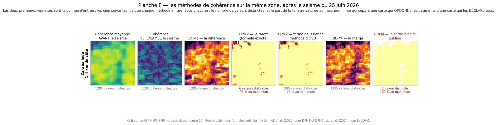

**Figure 15 — The coherence methods over the same area, after the earthquake of 25 June 2026 (Caraballeda, 1.4 km across). The first two vignettes are the input data; the next five, what each method draws from it. Beneath each one: the number of distinct values, and the share of the window saturated at the maximum — which separates a map that ranks buildings from a map that declares them all.**

The first two vignettes show the input data: the mean coherence before the earthquake and the coherence following it. The next five vignettes show the outputs of the different methods.

Raw post-event coherence contains many distinct values and retains a relatively rich spatial structure. It can therefore order buildings according to different signal levels. Conversely, some transformations strongly reduce the diversity of values:

- DPM2 in its exact published form retains only six distinct values, with 96 % of pixels reaching the maximum;
- the Gaussian form of DPM2 retains more values, but 76 % of pixels still reach the maximum;
- the published binary output of BDPM retains only a single distinct value over the area: it declares buildings according to a yes/no rule, with no continuous ranking.

This difference is essential. A binary output can flag sectors, but it no longer allows buildings to be finely ordered. Yet the AUC evaluates precisely that ranking capability.

For a continuous score Sᵢ, the AUC can be interpreted as:

AUC = P( S⁺ > S⁻ )

where S⁺ is the score of a positive building and S⁻ that of a negative one. If almost the whole area holds the same value, the score can no longer provide a detailed ranking. It becomes essentially a uniform declaration.

Coherence published in binary form must therefore not be compared directly with a continuous score as if they carried the same amount of information. A binary output may reach useful performance for a given decision rule, but it loses the information needed to prioritise objects relative to one another.

### 9.3 The results over fifteen areas

Figure 16 presents the pooled AUCs, centred by area, over the fifteen Syrian areas.

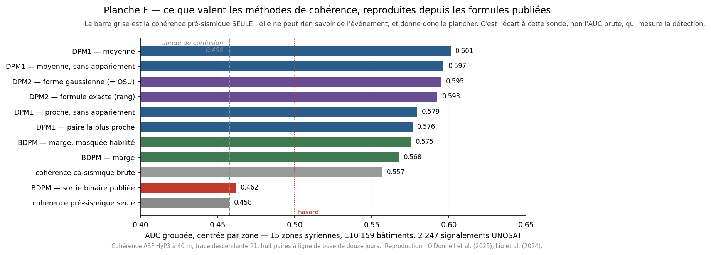

**Figure 16 — What the coherence methods are worth, reproduced from the published formulas. The grey bar (pre-seismic coherence alone) can know nothing of the event: it gives the floor. It is the gap from this probe, not the raw AUC, that measures detection.**

The lower grey bar corresponds to pre-seismic coherence alone. It contains no information about the earthquake and therefore constitutes a confusion probe: if a post-event method does not clearly exceed that reference, its ranking may come from the pre-existing structure of the scene rather than from the change tied to the event.

The results are as follows:

| Method | Pooled AUC |
|---|---|
| DPM1 — mean | 0.601 |
| DPM1 — mean, without pairing | 0.597 |
| DPM2 — Gaussian form, OSU method | 0.595 |
| DPM2 — exact formula | 0.593 |
| DPM1 — nearest, without pairing | 0.579 |
| DPM1 — nearest pair | 0.576 |
| BDPM — margin, reliability-masked | 0.575 |
| BDPM — margin | 0.568 |
| Raw co-seismic coherence | 0.557 |
| BDPM — published binary output | 0.462 |
| Pre-seismic coherence alone | 0.458 |

Pooled AUC, centred by area, of the coherence methods reproduced over 15 Syrian areas (110,159 buildings, 2,247 UNOSAT reports).

DPM1 with the mean obtains the best AUC, 0.601, but the gain above chance remains modest. DPM2 in its Gaussian form reaches 0.595 and raw co-seismic coherence 0.557.

BDPM's published binary output obtains 0.462, hence below chance in this sample. That result does not necessarily mean the method is useless in every context. It shows that, reproduced within this protocol and evaluated over these fifteen areas, its binary output does not provide a ranking that discriminates damaged buildings above intact ones.

The gap between 0.601 and 0.595 is small. It does not justify declaring DPM1 generally superior to DPM2 or to OSU. The more robust finding is that the reproduced methods are slightly informative, but limited in this sample.

### 9.4 Pre-event coherence as a confusion test

Pre-seismic coherence serves as an important control: it does not know the date of the earthquake. If it already ranks buildings, part of the AUC may come from urban structure rather than from the change tied to the event.

In the results presented, pre-seismic coherence alone reaches 0.458, while raw co-seismic coherence reaches 0.557. The difference is positive:

ΔAUC = 0.557 − 0.458 = 0.099

The transformed methods reach higher values, up to 0.601 for DPM1 with the mean. But part of their information may still come from the pre-existing structure, from urban geometry or from the distribution of coherence values. The pre-seismic bar is therefore not a perfect negative control, but it indicates the performance a signal with no knowledge of the event can already obtain.

Raw AUC is therefore not enough. It must also be verified that the method exceeds this pre-event reference and remains informative once the pre-existing structure is controlled for.

### 9.5 Why coherence is not sufficient

These results explain why coherence does not replace radar intensity in this study.

Coherence mainly measures whether the organisation of scatterers has changed. It measures directly neither the quantity of material destroyed, nor the extent of the collapse, nor the severity of the damage. A small modification and a complete destruction may both produce a large loss of coherence if the electromagnetic structure changes enough.

Coherence is also sensitive to weakly backscattering surfaces. When the signal-to-noise ratio is low, a surface may appear decorrelated even if the real change is limited. This limitation matters particularly for roads and smooth surfaces, but it also concerns buildings whose radar signature is weak or unstable.

Finally, the choice of image pairs, of the reliability threshold, of the pairing method and of the statistical transformation strongly alters the output. The maps in Figure 15 show that two methods applied to the same data can produce very different distributions: one keeps a continuous score, another concentrates almost all pixels at a maximum value, another still reduces the output to a binary.

### 9.6 Consequence for fusion

Coherence therefore brings complementary information, but not robust enough to be used alone as a general measure of damage. This conclusion is consistent with section 8: fusing T-stat and coherence improves the ranking, but the improvement comes from combining two imperfect signals, not from replacing intensity with coherence.

The best strategy is to keep the two quantities separate until the fusion stage:

- intensity reports on the change in backscatter;
- coherence reports on the preservation or rupture of the electromagnetic structure;
- their combination produces a more robust ranking than either signal alone in the experiments conducted.

It must nonetheless be avoided to present coherence as independent evidence of damage. Both quantities come from Sentinel-1 data and may share certain errors tied to geometry, moisture, vegetation or signal-to-noise ratio. Fusion improves the ranking, but it does not guarantee the independence of the sources.

### 9.7 What the experiment allows one to conclude

The results support four conclusions:

1. The coherence methods reproduced from the published formulas are slightly informative over the fifteen Syrian areas, but their performance remains modest.

2. DPM1 with the mean gives the best result in the experiment, with an AUC of 0.601, without the gap from DPM2 being sufficient to establish general superiority.

3. A binary output loses a large part of the information needed for ranking, as Figure 15 and BDPM's published AUC of 0.462 show.

4. Coherence is useful as information complementary to intensity, but it must not be presented alone as a direct measure of severity or passability.

The method retained in what follows therefore keeps coherence as a complementary component, to be fused with intensity in cases where both products are available. The final result remains an indicator of change and prioritisation, not an automatic certification of damage.

## 10 What the satellite allows one to decide

The analysis establishes a limited but useful role for radar. It replaces neither the very high resolution optical image nor field expertise, and it does not automatically produce a certain map of destroyed buildings. It can, on the other hand, provide an indicator of change over a chosen area when optical imagery is absent, cloudy, late or too slow to interpret manually.

The first result is a complementarity of timing. Optical imagery remains the best source for describing a building visually when the image is usable. But, as figure 3 shows, a highly detailed image arriving several days after the event can be less useful for the first prioritisation than a radar signal that is less legible but available earlier and over a wide area.

Radar answers that constraint with acquisitions by day and by night, independent of cloud cover. That availability advantage does not constitute a capacity for automatic interpretation: the signal depends on geometry, vegetation, moisture and the pixel's own stability. It must be compared with a history.

### 10.1 What the method makes it possible to do

PWTT turns a Sentinel-1 time series into a continuous change score. In the implementation described here, the computation actually used is the pooled-variance form of Student's test:

$$t = \frac{\bar{x}_{\text{post}} - \bar{x}_{\text{pre}}}{s_p \sqrt{\dfrac{1}{n_{\text{pre}}} + \dfrac{1}{n_{\text{post}}}}}$$

where s_p is the pooled standard deviation defined by equation (5). The code released by Ballinger uses this same form; the separate-variance formula written in the article, Welch's, has been offered by the reference repository only since June 2026, and section 4.3 compares the two. This point must remain explicitly documented, because it forbids interpreting T values directly as confidence levels.

When several post-event images are not yet available, a z-test type score can be computed from a single image:

$$z = \frac{x_{\text{post}} - \bar{x}_{\text{pre}}}{s_{\text{pre}}}$$

The z-score allows a first indicator with less statistical information. The trials show that a single image can be useful, but that the acquisition delay remains decisive; the results are more reliably usable around two days in the sample studied. That benchmark is not a universal threshold.

The continuous score then makes it possible to rank buildings or pixels by their level of change. That choice is preferable to immediate classification into damage classes. The results show that the radar signal is more reliable for separating buildings that have changed from buildings that have remained stable than for distinguishing several degrees of severity precisely.

### 10.2 What the comparisons establish

Over the common footprint, the T-stat obtains a mean AUC of 0.740 against Copernicus and ChatMap, ahead of OSU (0.732) and NASA DRCS S2 (0.716). It is therefore competitive within this protocol, without being declared best in every context.

This result must be interpreted with caution. It does not mean that the T-stat is better in every context, but that its ranking is favourable within the comparative protocol adopted. Comparison over a common footprint is indispensable, because the AUCs obtained over each product's own area do not answer the same question.

The comparison also shows that fusion can improve the ranking. Fusing the T-stat with OSU reaches a mean AUC of 0.7635, against 0.7403 for the T-stat alone. The gain is therefore:

ΔAUC = 0.7635 − 0.7403 = 0.0232

This gain is positive in all four fusion configurations tested with different coherence partners. It remains modest, but it is more convincing than an isolated improvement, because it recurs across several footprints.

In the trials, the mean of ranks is the most robust rule. Disjunction, which retains the most alarming signal, by contrast systematically degrades the ranking. It increases sensitivity to false alarms and can produce too broad a list of addresses to check. Conjunction is stricter and may suit a confirmation logic, but it reduces the number of buildings retained.

### 10.3 Two operational uses

The results do not lead to a single setting, because the best strategy depends on the use.

If a few teams must be sent out quickly, the aim is to maximise precision among the first buildings visited. The highest scores must then be favoured, accepting that not all affected buildings will be covered immediately.

If the aim is to miss no important sector, recall must on the contrary be favoured. The volume of buildings or of area to review will be larger, but the method must make it possible to find a high proportion of the positive buildings.

These two uses can be represented by different indicators:

Precision(k) = (positives found among the first k objects) / k

Recall(q) = (positives found in the first q % of objects) / (total positives)

Precision at the top and cumulative recall therefore do not measure the same thing. A method may be excellent at placing a few damaged buildings at the head of the ranking without being the best at covering the whole area. The tool's output must consequently support both uses rather than impose a single class or threshold.

### 10.4 The particular case of roads

Transposing the reasoning to roads must be formulated with greater caution. Crossing a change map with a road network is an established practice, notably in the UN-SPIDER recommendation, which speaks of segments liable to be blocked and of a high probability of rubble.

But the measurement carried out on road data does not validate the detection as it stands. In Venezuela, the Copernicus ground truth contains only three road positives among 24,696 features. No AUC or recall measure is therefore interpretable for that event.

In Jamaica, where the road ground truth is better populated, the result is unfavourable: segments classified as damaged show on average lower T-stat scores than segments classified as intact, with an AUC of about 0.32 for the strict positives. The ranking is therefore inverted in that sample.

This result forbids presenting the output as a detection of damaged roads, of severed roads or of impassable routes. The defensible formulation is that of a flagging of change along the road network, or of segments with a high probability of rubble, with validation still insufficient.

This limitation may be explained by the radar's spatial resolution, by the mixing of roadway and immediate surroundings, by building layover, and by the influence of moisture or vegetation. Above all it is a reminder that radar measures a change of surface along a line, and not the passability of a route directly.

### 10.5 What the tool does not allow one to assert

These results do not support the assertion that:

- every building flagged is damaged;
- the continuous score constitutes a probability of damage;
- a value of T corresponds directly to a statistical confidence level in the current implementation;
- the method provides a reliable estimate of damage severity;
- radar allows accessibility or travel time to be measured directly;
- a flagged road segment is necessarily impassable;
- inverting the road score would suffice to make the function valid;
- the method transfers without reservation from an earthquake to a cyclone.

The result must therefore be presented as an automated, reproducible and continuous indicator of radar change, intended to prioritise further analysis.

### 10.6 The position adopted

The method is defensible on three conditions.

The first is to keep a vocabulary proportionate to the signal: change, ranking, priority, probability of rubble or observation to be checked, rather than certain damage or passability.

The second is to keep the output in continuous form. Thresholds may be expressed in percentiles according to the volume of objects a team is able to check, but a percentile must not be presented as a probability of error.

The third is to integrate the tool into a decision chain rather than use it alone:

1. radar provides a first ranking;

2. optical imagery confirms or refines the change once the image is available;

3. coherence brings complementary information;

4. aerial or field assets verify the priority sectors;

5. new acquisitions update the ranking.

Within this chain the tool does not replace the expert: it helps determine where to mobilise human expertise or detailed observation first.

The next part therefore leaves the analysis of satellite performance to examine the concrete implementation of the chain: data used, parameters, architecture of the QGIS plugin, reproducibility, outputs produced and conditions of operational use.

## Limitations

The preceding sections evaluated radar's ranking power using two different references: Copernicus EMS, derived from expert photo-interpretation, and ChatMap, which gathers field reports accompanied by photographs or videos. No dedicated UNOSAT product was identified for Venezuela; UNOSAT served as a reference for Jamaica only.

These references do not constitute a complete ground truth; this limitation conditions the whole calibration. Copernicus EMS rests on the photo-interpretation of optical imagery acquired in a near-nadir view. Cotrufo et al. (2018) document the very basis on which that operational classification was built: a scale derived and simplified from the 1998 European Macroseismic Scale, precisely in order to account for the limitations inherent in remote sensing. The service does in fact provide a "damage not visible" class, and itself points out that its products constitute an indirect estimate and not ground-truth data.

Those same authors measure that limitation empirically on the 2016 Italian earthquake at Amatrice, this time taking a drone survey as the reference. The result can be read in the user's accuracy, that is, the proportion of buildings genuinely in a class among those the map placed there: it reaches only 42 % for the "damage not visible" class and 28 % for "possible damage", whereas it peaks at 94 % for "damage" and 100 % for "destroyed". In other words, when the vertical view announces destruction it is right, and when it announces the absence of visible damage it is wrong three times out of five.

This geometric limitation is confirmed at an entirely different scale. Ainscoe et al. (2025) compare, after the 2023 Kahramanmaraş earthquakes, the damage maps derived from optical and radar imagery with the inspections conducted on the ground by some eight thousand officials, building by building, across nearly two million buildings. The radar product's recall reaches 0.59 — it therefore finds 59 % of the genuinely damaged buildings — whereas optical methods identify only 8 to 17 % of them. Overall performance points the same way, with an F1 score of about 0.47 for radar against 0.15 to 0.24 for the optical products. And the availability gap is sharper still: radar covered the entire affected area in ten days, whereas very high resolution optical imagery covered only 5.4 % of it in the same time, i.e. eleven thousand square kilometres.

The reason is mainly geometric. An image taken from directly overhead shows only what is exposed to the zenith: the roof, and whatever extends beyond its footprint. Yet a building does not necessarily collapse from the top. It may lose a façade, see its floors crush one onto another, or tilt on a soft storey, without its roof ceasing to occupy the same ground area. The signal a change-detection method looks for — a modification of the footprint, the texture or the backscatter of the roof — is then weak or absent, even though the building is lost.

Five cases from the earthquake of 24 June 2026, documented on the ground, illustrate this, and reproduce at building scale what the literature measures at regional scale. Three are at Catia La Mar, two at Caraballeda. The failure modes differ — floors collapsed onto one another, tilting onto a crushed ground floor, a façade carried away — but they have in common that they leave the roof in place. On the aerial images acquired three days after the event, at thirty-three and thirty-five centimetres, none of the five stands out clearly from its earlier state: one sometimes makes out a little street debris, never the loss of the building. At fifty centimetres and at eighty-six centimetres, two resolutions genuinely available over the area, there is nothing left to read; and on Sentinel-2 at ten metres the building simply does not exist as a distinct object. The loss is therefore not gradual: it is already complete at the best resolution available.

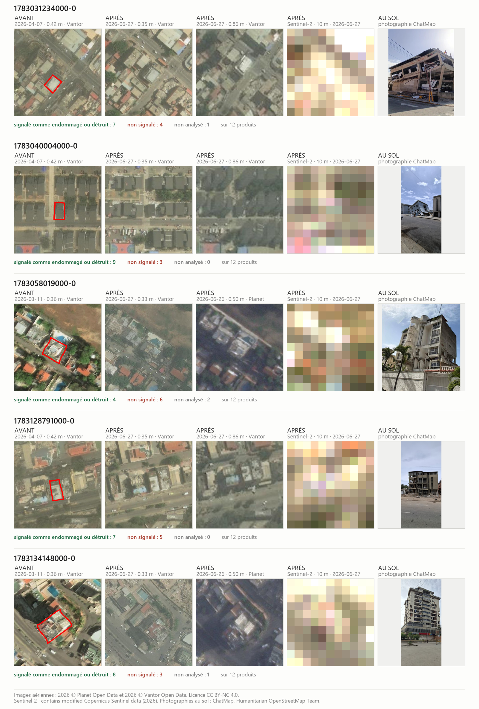

**Figure 9 — What a vertical view does not show of a lateral collapse.** Five buildings destroyed in the earthquake of 24 June 2026, three at Catia La Mar and two at Caraballeda, each documented on the ground by a photograph. Each row presents, from left to right: an aerial acquisition before the event, two real aerial acquisitions after the event at different resolutions, the Sentinel-2 image at 10 metres, and the photograph taken on the ground. **All the vignettes are real acquisitions**: none is obtained by degrading another. Resolution is therefore not the only variable — the dates and look angles differ from one vignette to the next, and they are given beneath each — but the scale so formed shows only what was actually available for this disaster. Beneath each row is the number of damage-mapping products that flagged this building, did not flag it, or did not analyse it for want of a footprint, out of the twelve products compared. ChatMap is excluded from that count: the observation is made on the ground and not from space, and it is what served to select the five buildings. Aerial imagery: 2026 © Vantor Open Data and 2026 © Planet Open Data, licence CC BY-NC 4.0. Sentinel-2: *contains modified Copernicus Sentinel data (2026)*. Ground photographs: ChatMap, Humanitarian OpenStreetMap Team.**

The product count points the same way. Of the sixty verdicts formed by these five buildings and the twelve products compared, **58 % flag the building, 35 % do not, and 7 % do not cover it** for want of a footprint — that is, counting only the buildings actually analysed, **nearly four verdicts in ten miss a destruction established on the ground**. The spread between cases is considerable: the best-seen building is seen by nine products out of twelve, the least well seen — the one whose façade went — by only four. Three products flag all five: Copernicus EMS, OSU and NASA DRCS S2; conversely, NASA DRCS S1 flags none and HOT fAIr only one. Our T-stat flags four out of five.

This observation does not invalidate the earlier ranking, but it refines its interpretation. A disagreement between the radar method and an optical ground truth may reveal a limitation of the method as much as a limitation of the reference itself, and nothing in the discrepancy says which. Optical and radar perhaps do not so much contradict each other as simply not look at the same thing: one aims at the roof from nadir, the other reaches the façades from the side. Cotrufo et al. themselves settle that hierarchy by taking the drone, and not vertical imagery, as the reference for their validation.

The scope of part 2 must therefore be stated precisely. The method flags sectors where something has changed, and it does so quickly, at night, under cloud and without field access. But a flagged sector is not a diagnosed building, and an unflagged sector is not an undamaged one. It is the asymmetry that matters operationally: the false negatives of the vertical view are not distributed at random, they concentrate on one particular collapse mode, the one that leaves the roof in place — and that is exactly the intermediate grade that our two case studies already identified as the weak point common to all the methods compared.

This hierarchy justifies the funnel approach of the following part: the satellite prioritises, aerial assessment confirms at a finer resolution and sometimes from an oblique angle, and the drone closes the loop on the most ambiguous cases, down to the façade itself. The practical consequence is in fact measurable in our case: between the satellite image at thirty-five centimetres and the field observation there existed, for this disaster, no intermediate acquisition at all, the catalogue containing neither drone flight nor aircraft flight over the affected areas. It is precisely that gap that the following part seeks to fill — not by better vertical resolution, but by a close and sometimes oblique view that only a light aircraft can provide.

## APPENDIX — Dictionary of damage-mapping methods

Venezuela earthquake, June 2026. Each entry describes the method used by its source and points to its data or its documentation. The figures given are method parameters, not a ranking of the products.

**CEMS (Copernicus EMS)** — Manual photo-interpretation of before/after very high resolution optical imagery. Analysts assign visible buildings the classes Destroyed, Damaged or Possibly damaged. Output: annotated buildings.
Data / method access: <https://mapping.emergency.copernicus.eu/activations/EMSR884/aois>

**ChatMap** — Geolocated field reports, accompanied in some cases by photographs and damage observations. Output: report points to be matched with buildings.
Data / method access: <https://chatmap.hotosm.org/#map/e5e685ff-83eb-495b-be16-271513992cfd>

**HOTOSM / MapSwipe** — Crowdsourced verification of alerts on optical imagery: several volunteers examine preselected areas and indicate whether damage is visible or uncertain. Output: validated sectors or H3 cells.
Data / method access: <https://huggingface.co/datasets/hotosm/venezuela_eq_2026>

**OSU/CUNY — Sentinel-1 CCD** — Detection of an unusual fall in radar coherence: each post-earthquake acquisition is compared with about one year of prior coherence, then the z-score is carried onto Overture footprints. A tier is assigned if the signal covers at least 50 % of the footprint: possible (z ≥ 1.5), probable (z ≥ 2) or high confidence (z ≥ 3). Output: footprints and confidence tiers.
Data / method access: <https://oregonstate.app.box.com/s/yrgtsbwmpqpajuhzioq0k13ihfluuneg/folder/394695539753>

**EOS-RS — Sentinel-1 DPM** — Radar change map between a prior series from 24 February to 13 June and an image of 25 June 2026. Pixels of about 30 m, coloured by the magnitude of the surface change; no structural class is assigned to each building.
Data / method access: <https://sf.earthobservatory.sg/event/EOSRS_2026_005_VEN_EQ_202606_Caracas>

**IMPACT Initiatives — Sentinel-1 DPM** — Z-score of Sentinel-1 GRD amplitude change relative to an annual reference, with two paired later acquisitions from 25 June. After masking built surfaces, an Overture footprint is retained if at least 50 % of its area intersects the radar proxy.
Data / method access: <https://data.humdata.org/dataset/venezuela-earthquakes-damage-assessment-using-sentinel-1-radar-data>

**NASA DRCS/Ames — Sentinel-1** — Subtraction of the VV backscatter of 18 June from that of 25 June 2026 over ESA WorldCover built-up areas. Falls of ≤ −8 dB, of −8 to −6 dB and of −6 to −4 dB form cartographic alert levels. Output: change pixels.
Data / method access: <https://gis.earthdata.nasa.gov/portal/home/item.html?id=b205e94bcc2c4096acf7201da3116272>

**NASA DRCS/Ames — Sentinel-2** — Detection of a joint increase in visible brightness and SWIR1 between pre- and post-earthquake composites. Visible resolution 10 m, SWIR1 20 m; mean, maximum and percentiles of the score summarised per Google Open Buildings footprint.
Data / method access: <https://gis.earthdata.nasa.gov/portal/home/item.html?id=27a7b4306a5e4ab68be2adb8c6ec83bd>

**Microsoft AI for Good Lab** — Optical model classifying pixels as building, damage, cloud or other. The percentage of pixels classified as "damage" is computed within each Overture footprint and within 10 and 20 m buffers. Output: per-building attributes.
Data / method access: <https://visualizers.aiforgood.ai/damage-assessment/venezuela_earthquake_2026_report.html>

**HOTOSM fAIr** — Two optical models: building segmentation, then damage estimation on before/after images. The DINOv3 damage model assigns the classes no damage, minor, major or destroyed, with a confidence score. Output: footprints and predicted classes.
Data / method access: <https://huggingface.co/hotosm/earthquake-damage-assessment-model>

**UH SAIL / QuakeDamage** — Siamese DINOv3 optical comparison network trained on images of earlier earthquakes. It compares the before/after views and classifies damage per building on footprints refined from Overture.
Data / method access: <https://quakedamage.github.io/>

**DISHA** — Footprints from Google Open Buildings and a damage assessment model on very high resolution optical imagery. Output: buildings with an automatic damage prediction.
Data / method access: <https://data.humdata.org/dataset/venezuela-building-damage-analysis-disha> ·
<https://disha.unglobalpulse.org/our-products/> ·
<https://disha.unglobalpulse.org/dishas-revamped-ai-assisted-damage-assessment-solution-enters-a-new-phase-of-growth-and-operational-impact/>

**UNEP — debris estimation** — Combination of a Sentinel-1 PWTT adapted to a z-score, CEMS annotations, PlanetScope interpretation and local optical or radar products. The buildings and modelled heights of the Global Building Atlas are then used to estimate debris.
Data / method access: <https://data.humdata.org/dataset/building-debris-assessment-venezuela-earthquake-june-2026>

**T-stat** — Temporal anomaly method applied to Sentinel-1 GRD backscatter: comparison of each pixel with its history, combination of the available observations and aggregation of the scores to building footprints. Output: continuous change score.

**BDPM (reproduction)** — Coherence-change method reproduced from the publication by Liu et al.: comparison of before/after coherences, with histogram matching and a reliability mask. Output: change score or mask depending on the setting.

**UNGSC** — Per-pixel change layer recorded, but the procedure, input data and thresholds are not documented in the available sources; no precise method can be attributed.

**WFP–LIST–CERN** — Announced deep learning method on before/after SAR imagery, of ResNet type, to produce a damage class per building. Data not found.

## Bibliography

The references used in this long version are gathered below. The works belonging to the aerial part, which are not needed for the satellite argument, remain in the thesis's general bibliography.

- Ainscoe, E. A., Swaminathan, R., Way, L., Modugno, S., Chin, S. T., Panta, N., Crevoisier, T., & Yun, S.-H. (2025). Earthquake damage mapped more comprehensively and accurately by radar satellites than optical imagery. Communications Earth & Environment, 6, 631. https://doi.org/10.1038/s43247-025-02107-1

- Ballinger, O. (2024). PWTT: Pixel-Wise T-Test for battle damage detection [Computer software]. https://github.com/oballinger/PWTT

- Ballinger, O. (2025). Open access battle damage detection via Pixel-Wise T-Test on Sentinel-1 imagery. Remote Sensing of Environment, 331, 115025. https://doi.org/10.1016/j.rse.2025.115025

- Cotrufo, S., Sandu, C., Giulio Tonolo, F., & Boccardo, P. (2018). Building damage assessment scale tailored to remote sensing vertical imagery. European Journal of Remote Sensing, 51(1), 991–1005. https://doi.org/10.1080/22797254.2018.1527662

- Dietrich, O., Peters, T., Sainte Fare Garnot, V., Sticher, V., Ton-That Whelan, T., Schindler, K., & Wegner, J. D. (2025). An open-source tool for mapping war destruction at scale in Ukraine using Sentinel-1 time series. Communications Earth & Environment. https://doi.org/10.1038/s43247-025-02183-7

- Ehrlich, D., Guo, H., Molch, K., Ma, J., & Pesaresi, M. (2009). Identifying damage caused by the 2008 Wenchuan earthquake from VHR remote sensing data. International Journal of Digital Earth, 2(4), 309–326. https://doi.org/10.1080/17538940902767401

- Ge, P., Gokon, H., & Meguro, K. (2020). A review on synthetic aperture radar-based building damage assessment in disasters. Remote Sensing of Environment, 240, 111693. https://doi.org/10.1016/j.rse.2020.111693

- Jung, J., Yun, S.-H., Kim, D., & Lavalle, M. (2018). Damage-Mapping Algorithm Based on Coherence Model Using Multitemporal Polarimetric-Interferometric SAR Data. IEEE Transactions on Geoscience and Remote Sensing, 56(3), 1520–1532. https://doi.org/10.1109/TGRS.2017.2764748

- Plank, S. (2014). Rapid Damage Assessment by Means of Multi-Temporal SAR - A Comprehensive Review and Outlook to Sentinel-1. Remote Sensing, 6(6), 4870–4906. https://doi.org/10.3390/rs6064870

- Saito, K., Spence, R. J. S., Going, C., & Markus, M. (2004). Using High-Resolution Satellite Images for Post-Earthquake Building Damage Assessment: A Study following the 26 January 2001 Gujarat Earthquake. Earthquake Spectra, 20(1), 145–169. https://doi.org/10.1193/1.1650865

- Salaheldin, A. (2026). PWTT QGIS Plugin: Pixel-Wise T-Test for building damage detection [Computer software]. QGIS Plugins. https://plugins.qgis.org/plugins/pwtt_qgis/

- Scher, C., & Van Den Hoek, J. (2025). Active InSAR monitoring of building damage in Gaza during the Israel-Hamas War. arXiv:2506.14730. https://arxiv.org/abs/2506.14730

- Scher, C., & Van Den Hoek, J. (2025). Nationwide conflict damage mapping with interferometric synthetic aperture radar: A study of the 2022 Russia-Ukraine conflict. Science of Remote Sensing, 11, 100217. https://doi.org/10.1016/j.srs.2025.100217

- Scher, C., & Van Den Hoek, J. (2026). Building Damage Assessment Portal—Open Access Satellite Conflict Damage Data. https://damage.conflict-ecology.org/

- Student. (1908). The Probable Error of a Mean. Biometrika, 6(1), 1–25. https://doi.org/10.2307/2331554

- Wang, X., Feng, G., He, L., An, Q., Xiong, Z., Lu, H., Wang, W., Li, N., Zhao, Y., Wang, Y., & Wang, Y. (2023). Evaluating Urban Building Damage of 2023 Kahramanmaras, Turkey Earthquake Sequence Using SAR Change Detection. Sensors, 23(14), 6342. https://doi.org/10.3390/s23146342

- Welch, B. L. (1947). The generalization of Student's problem when several different population variances are involved. Biometrika, 34(1–2), 28–35. https://doi.org/10.1093/biomet/34.1-2.28

- Westrope, C., Banick, R., & Levine, M. (2014). Groundtruthing OpenStreetMap Building Damage Assessment. Procedia Engineering, 78, 29–39. https://doi.org/10.1016/j.proeng.2014.07.035

- Westrope, C., Banick, R., & Levine, M. (2014). Groundtruthing OpenStreetMap Damage Assessment Review—Interim Report. REACH Initiative / ACTED and American Red Cross. https://americanredcross.github.io/OSM-Assessment/

## Notes

[^8]: International Charter Space and Major Disasters, "About the Charter" and documentation relating to activation mechanisms, consulted in September 2026, <https://disasterscharter.org>. The Charter coordinates the provision of data and products for the benefit of authorised users; it must not be equated with a bank of images freely downloadable without condition.

[^9]: Calculation table: [`tables/charte_synthese_optique_radar.csv`](../../tables/charte_synthese_optique_radar.csv).

[^10]: Author's calculation from the activation time of Copernicus EMSR847 and the passage time of Cyclone Melissa adopted in the event chronology. Calculation table: [`tables/cems_delais_par_activation.csv`](../../tables/cems_delais_par_activation.csv).

[^11]: The Signal project, launched in 2021 by Humanité & Inclusion and Atlas Logistique in nine countries, from the logistical vulnerability index whose methodology had been developed after Cyclone Idai. <https://www.hi.org/fr/actualites/signal---un-projet-innovant-pour-renforcer-la-resilience-logistique-des-communautes-vulnerables-en-contexte-fragile>

[^12]: Ballinger, O. (2025). Open access battle damage detection via Pixel-Wise T-Test on Sentinel-1 imagery. *Remote Sensing of Environment*, 331, 115025. The preprint version (arXiv:2405.06323, 2024) reports 0.88 and 0.81; the published version gives slightly lower values. The difference illustrates how sensitive performance is to the geographical scope and validation set adopted.

